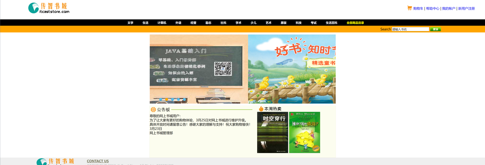
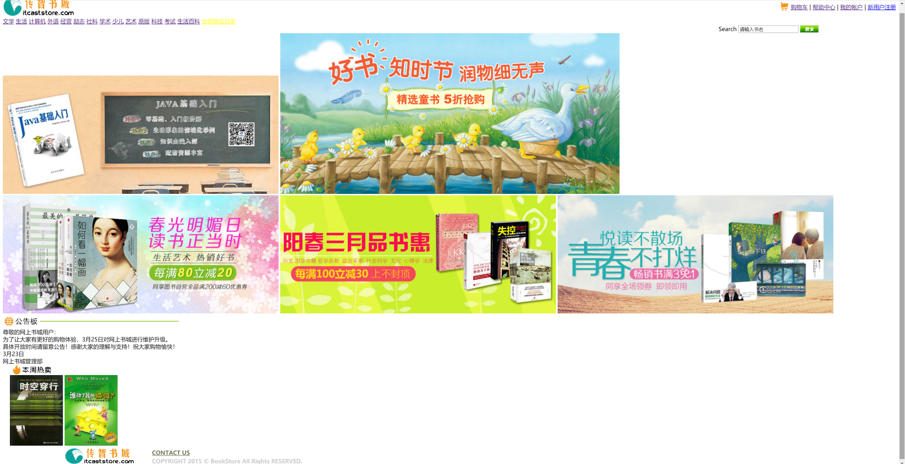

# 实验一：Web客户端技术
## 一．	实验目的
1. 掌握Dreamweaver、Code等工具的使用
2. 熟悉HTML的常用标记
3. 熟悉CSS选择器和常用属性
4. 掌握HTML+CSS+JavaScript的开发基础

## 二．	实验类型：验证型

## 三．	实验学时：8学时

## 四．	实验原理及知识点
1. HTML的常用标记包括文字与段落，建立列表，图片及多媒体文件的使用，建立超链接，建立表单页面
2. 页面的布局
3. 样式语法，样式属性，样式类
4. 脚本语言语法，HTML DOM模型，事件响应模型。

## 五．实验环境（硬件环境、软件环境）
1. 硬件环境：微型电子计算机Intel Pentium 4 CPU 1.2GHz，512MB RAM及以上
2. 软件环境：
操作系统：Windows 7 以上
Web服务器：Tomcat 8 以上
软件工具：Eclipse 4 集成开发工具+ MySQL 5、Chrome浏览器

## 六．	实验内容及步骤
## 书城首页的实现（5分）
### 功能：
+ 布局（9月12日截止）
+ 菜单（9月19日截止）
+ 广告页轮播（9月19日截止）
### 效果图
+ HTML+CSS效果图:
+ 
+ 不使用CSS的效果图:
+ 
### 实现步骤
### 1.创建资源文件夹

### 2.布局
#### 1）写出HTML的分层各部分
```html
<!DOCTYPE html PUBLIC "-//W3C//DTD HTML 4.01 Transitional//EN" "http://www.w3.org/TR/html4/loose.dtd">
<html>

<head>
    <link href="../style/main.css" rel="stylesheet">
    <!-- 顶部的CSS文件 -->
    <link href="../style/divmenu.css" rel="stylesheet">
    <!-- 菜单的CSS文件 -->
    <link href="../style/autoplay.css" rel="stylesheet">
    <!-- 轮播图的CSS文件 -->
    <link href="../style/divfoot.css" rel="stylesheet">
    <!-- 底部的CSS文件 -->
    <link href="../style/divcontent.css" rel="stylesheet">
    <!-- 其它区域的CSS文件 -->
    <link href="../style/divsearch.css" rel="stylesheet">
    <!-- 搜索部分的CSS文件 -->

    <style type="text/css">
    </style>

    <meta http-equiv="Content-Type" content="text/html; charset=UTF-8">
    <title>首页</title>
</head>

<body class="main">
    <!-- 1.网上书城顶部 start -->
    <div id="divhead">
    </div>
    <!-- 网上书城顶部  end -->

    <!--2. 网上书城菜单列表  start -->
    <div id="divmenu">
    </div>
    <!-- 网上书城菜单列表  end -->

    <div id="divsearch">
    </div>
    <!-- 3.网上书城首页轮播图  start -->
    <div id="banner">
        <div id="box_autoplay">
        </div>
    </div>
    <!-- 网上书城首页轮播图  end -->

    <!--4. 公告板和本周热卖  start -->
    <div id="divcontent">
    </div>
    <!-- 公告板和本周热卖  end -->

    <!--5. 网上书城底部 start -->
    <div id="divfoot">
    </div>
    <!-- 网上书城底部  end -->
</body>

</html>
```
#### 2）为每个层布局，定义背景色和大小、定位（宽度、高度、框模型），局部通过table来设置位置
+ divhead 头部区域通过table布局，创建一行两列的表格。
```html
		<table style="width: 100%;" cellspacing="0" class="headtable">
        <!-- 宽设置为100%,使购物车那一栏向右靠齐 -->
            <tr>
                <td>
                    <a href="#">
                        
                    </a>
                </td>
                <!--此单元格样式靠右边对齐-->
                <td style="text-align:right;">
                    &nbsp;<a
                        href="#">购物车</a>
                    | <a href="#">帮助中心</a>
                    | <a href="#">我的帐户</a>
                    | <a href="register.html">新用户注册</a>
                </td>
            </tr>
        </table>
<!--main.css中设置的样式-->
#divhead {
	width: 100%;
}
#divhead a{
    <!-- 去除下划线 -->
	text-decoration: none;
}
.headtable td {
	padding: 10px 50px 25px 135px;
}
```
+ divmenu 菜单项布局
```html
#divmenu {
    padding: 5px;
    text-align:center;
	width: 100%;
    background-color: #000000;
	}
```
+ divsearch  内部元素用table布局
```html
    <div id="divsearch">
        <form action="#" id="searchform">
            <table width="100%" border="0" cellspacing="0">
                <tr>
                    <!--样式中 右内边距定位-->
                    <td style="text-align:right; padding-right:220px">
                        Search
                        <input type="text" name="textfield" class="inputtable" id="textfield" value="请输入书名"
                            onmouseover="this.focus();" onclick="my_click(this, 'textfield');"
                            onBlur="my_blur(this, 'textfield');" />
                            <!-- 点击输入框的监听器 -->
                        <a href="#">
                            
                                <!-- 点击搜索按钮后进行搜索 -->
                        </a>
                    </td>
                </tr>
            </table>
        </form>
    </div>
```
+ box_autoplay
```html
<div id="banner">
        <div id="box_autoplay">
            <div class="list" id="images">
                <!-- 轮播图的广告页面 -->
                
                
                
                
                
            </div>
            <div class="btn" id="btns">
                <!-- 轮播图的5个随之变换的点,具体设置在CSS文件中 -->
                <span class></span>
                <span class></span>
                <span class></span>
                <span class></span>
                <span class></span>
                <div class="clear"></div>
            </div>
            <!-- javascript文件对轮播图的行为进行编写 -->
            <script src="../js/autoplay.js" async defer></script>
        </div>
    </div>
```
+ divcontent  内部元素用table布局
```html
<div id="divcontent">
        <div class="div">
            
            <div style="width: 500px;">
                <!-- &nbsp;&nbsp;&nbsp;&nbsp;暂无公告 -->
                    尊敬的网上书城用户：
                </br>为了让大家有更好的购物体验，3月25日对网上书城进行维护升级。
                </br>具体开放时间请留意公告！感谢大家的理解与支持！祝大家购物愉快！
                </br>3月23日
                </br>网上书城管理部
            </div>
            <div class="book">
                
                <div style="padding-left: 20px;">
                    
                    
                </div>
            </div>
        </div>
    </div>

<!-- divcontent.css -->
#divcontent {
	width: 900px;
	background-color: #FCFDEF;
	border: 1px solid #EEEDDB;
	MARGIN-RIGHT: auto;
	MARGIN-LEFT: auto;
}

#divcontent .div{
	position: relative;
	width: auto;
	height: 250px;
    <!-- 250像素的高度保证高度不会覆盖 -->
}

//热卖榜的CSS文件
#divcontent .book{
	position: absolute;
	top: 0;
	right: 0;
	width: 400px;//热卖榜的宽度规定400像素,防止覆盖
	height: auto;
}

```
+ divfoot 内部元素用table布局
```html
#divfoot {
	width: 100%;
	clear: both;
	background-color: #efefef;
	margin-top: auto;
}
    <div id="divfoot">
        <table width="100%" border="0" cellspacing="0">
            <tr>
                <td rowspan="2" style="width:10%">
                    
                </td>
                <td style="padding-top:5px; padding-left:50px">
                    <a href="#">
                        <font color="#747556"><b>CONTACT US</b></font>
                    </a>
                </td>
            </tr>
            <tr>
                <td style="padding-left:50px">
                    <font color="#CCCCCC">
                        <b>COPYRIGHT 2015 &copy; BookStore All Rights RESERVED.</b>
                    </font>
                </td>
            </tr>
        </table>
    </div>
```

### 3. 菜单的实现（或用列表项实现）

>>锚伪类
在支持 CSS 的浏览器中，链接的不同状态都可以不同的方式显示，这些状态包括：活动状态，已被访问状态，未被访问状态，和鼠标悬停状态。
a:link {color: #FF0000}		/* 未访问的链接 */
a:visited {color: #00FF00}	/* 已访问的链接 */
a:hover {color: #FF00FF}	/* 鼠标移动到链接上 */
a:active {color: #0000FF}	/* 选定的链接 */

```html
    #divmenu a {
        text-decoration: none;//取消下划线
        font-weight: bold;
        font-size: 14px;
        color: #FFFFFF;
        padding: 10px 10px 10px 30px;
    }

    #divmenu a:link {
        font-weight: bold;
    }

    #divmenu a:visited {
        color: #FFFFFF;
    }

    #divmenu a:hover {
        color: #999999;
    }

    #divmenu a:active {
        color: #FFFFFF;
    }
```
### 4. 首页轮播图css和js
#### 轮播图的关键点
#### 1）position定位：这个属性定义建立元素布局所用的定位机制。
参看 https://developer.mozilla.org/zh-CN/docs/Web/CSS/position
任何元素都可以定位，不过绝对（absolute值）或固定元素会生成一个块级框，而不论该元素本身是什么类型。相对定位（relative值）元素会相对于它在正常流中的默认位置偏移。
+ relative值用于 box-autoplay 和 box-autoplay list 两个 div 层。其中 list 作为 其后的列表的容器，设置width、height为一张图片大小，`overflow：hidden`定义溢出元素内容区的内容会如何处理。hidden 值则列表的内容会被修剪，并且其余内容不可见。
+ absolute值：通过指定元素相对于最近的非 static 定位祖先元素的偏移，来确定元素位置。用于 box-autoplay list ul 元素，ul是一个无序表，包含5个列表项，其内容都是图片，每张图片大小`900px*335px`，默认列表项的`display：block`块级元素。因此整个ul的尺寸就是`900px*(335*5)px`。它的top初始值是为0。

```html
<!--index.html-->
    <div id="banner">
        <!-- banner用于规定其内部的控件位置居中 -->
        <div id="box_autoplay">
            <!-- box_autoplay用于使轮播图相对于它的绝对布局 -->
            <div class="list" id="images">
                <!-- list是宽度可以容纳5张图片的一个容器 -->
                
                
                
                
                
            </div>
            <div class="btn" id="btns">
                <!-- 设计按钮区域的样式和位置 -->
                <span class></span>
                <span class></span>
                <span class></span>
                <span class></span>
                <span class></span>
                <div class="clear"></div>
            </div>
            <!-- 引入轮播图的Javascript文件 -->
            <script src="../js/autoplay.js" async defer></script>
        </div>
    </div>

<!--autoplay.css-->
<!-- 预定义一些值方便使用和更改 -->
* {
    margin:0;
    padding:0;
    --imageWidth:900px;
    --height:335px;
}

.clear {
    clear:both;
}

#banner {
	text-align: center;
	margin:0 auto;
    width:calc(var(--imageWidth));
	padding: 10px;
}

#box_autoplay {
	position:relative;
	width:var(--imageWidth);
	height:var(--height);
	overflow: hidden;
	background:#fff;
}

<!-- 对包含所有按钮的块进行位置和大小上的定义 -->
#box_autoplay .btn{
	position: absolute;
	left: 36px;
	bottom: 12px;
	z-index: 2;
}

<!-- 对span进行定义,并且使它的样式为圆形 -->
#box_autoplay .btn span{
	display: inline-block;
    margin-left: 10px;
    width: 10px;
    height: 10px;
    border: 2px solid transparent;
    border-radius: 50%;
    vertical-align: middle;
    cursor: pointer;
    transition: all .2s;
}

#box_autoplay .list {
    position:absolute;
	left: 0px;
    z-index: 1;
    width:calc(var(--imageWidth)*5);
    height:var(--height);
    transition: all 1s;
}
<!-- 对list中的图片进行定义,让它们水平对齐,同时使它们的长宽一致 -->
#box_autoplay .list img {
	float:left;
    width:var(--imageWidth);
    height:var(--height);
}
```
#### 2）在js中完成的部分（详见autoplay.js的注释）
+ `circles`为按钮
+ 将上一个按钮样式变回来,这一个按钮样式被选中
+ 设置定时器 `timer`，每3秒将当前图片换为下一张。
+ 设置鼠标在轮播图上时的反应`addEventListener`。
```js
var multiImages = document.getElementById("images");//获取轮播图所有图片的信息
var circles = document.getElementById("btns").getElementsByTagName("span");//获取所有按钮的信息
var box = document.getElementById("box_autoplay");//获取轮播图块的信息
var currentIndex = 0;//当前展示的轮播图ID
var preIndex = 0;//上一次展示的轮播图ID
var timer = null;//自动切换

for (let i = 0; i < circles.length; i++) {//对所有的按钮进行初始化
    circles[i].style.backgroundColor="rgb(88, 186, 231)";//规定按钮初始颜色
    circles[i].setAttribute("id", i);//对5个按钮进行id赋值(从0到4)
    circles[i].addEventListener("mouseenter", overCircle);//增加监听器,当鼠标进入
}
//对自动轮播的设置进行初始化
timer = setInterval(nextMove, 3000);//设定延时3秒切换
box.addEventListener("mouseover", function () {
    clearInterval(timer);
    //在鼠标移动到按钮上时清除延时设定
});
box.addEventListener("mouseout", function () {
    timer = setInterval(nextMove, 3000);
    //在鼠标移出按钮上时继续延时设定
});
changeCircleColor(preIndex, currentIndex);//更改按钮的颜色(即初始的时候把按钮的颜色更新为选中状态,只用一次)

//鼠标移动到按钮上时
function overCircle() {
    preIndex = currentIndex;
    currentIndex = parseInt(this.id);//收集当前被选中按钮的id
    // multiImages.style.transition="1.5s";
    changeCircleColor(preIndex, currentIndex);//把被选中和上次选中的按钮的颜色改变
    moveImage();
}

//更改按钮颜色(选中按钮)
function changeCircleColor(preIndex, currentIndex) {
    circles[preIndex].style.backgroundColor="rgb(88, 186, 231)";//上一次选中的按钮的颜色改变回初始值
    circles[currentIndex].style.backgroundColor="rgb(255, 165, 0)";
}

//上一张轮播图
function preMove() {
    preIndex = currentIndex;
    if (currentIndex != 0) {//在当前轮播图播放到第一张的时候返回第五张(从后往前)
        currentIndex--;
    }
    else {
        currentIndex = 4;
    }
    changeCircleColor(preIndex, currentIndex);//改变按钮颜色
    moveImage();//改变当前图片
}

//下一张轮播图
function nextMove() {
    preIndex = currentIndex;
    if (currentIndex != 4) {//在当前轮播图播放到第五张的时候返回第一张(从前往后)
        currentIndex++;
    }
    else {
        currentIndex = 0;
    }
    changeCircleColor(preIndex, currentIndex);//改变按钮颜色
    moveImage();//改变当前图片
}

//移动轮播图到下一张
function moveImage() {
    multiImages.style.left = -currentIndex * 900 + "px";//因为图片大小为900像素,因此直接水平平移900像素
}
```