实验进度安排表

实验内容 | 课时 | 实验报告提交时间
:--------- | :---------: | --------:
 书城首页的实现| 4课时| 2021/9/19
 注册页面的实现| 4课时| 2021/9/25
Servlet的用法|2课时|2021/10/2
HttpServletRequest、HttpServletResponse的用法|2课时|2021/10/9
RequestDispatcher的用法|1课时|2021/10/16
显示用户上次访问时间|1课时|2021/10/16
Session的用法|2课时|2021/10/23
JSP的用法|1课时|2021/11/6
EL和JSTL|1课时|2021/11/6
MVC模式|2课时|2021/11/20
JDBC|2课时|2021/12/4
Ajax|2课时|2021/12/18
# 实验一：Web客户端技术
[学习Web开发的MDN文档](https://developer.mozilla.org/zh-CN/docs/Learn)
[Bootstrap](https://v4.bootcss.com/docs/getting-started/introduction/)

## 一．	实验目的
1. 掌握Dreamweaver、Code等工具的使用
2. 熟悉HTML的常用标记
3. 熟悉CSS选择器和常用属性
4. 掌握HTML+CSS+JavaScript的开发基础

## 二．	实验类型：验证型

## 三．	实验学时：8学时

## 四．	实验原理及知识点
1. HTML的常用标记包括文字与段落，建立列表，图片及多媒体文件的使用，建立超链接，建立表单页面
2. 页面的布局
3. 样式语法，样式属性，样式类
4. 脚本语言语法，HTML DOM模型，事件响应模型。


## 五．实验环境（硬件环境、软件环境）
1. 硬件环境：微型电子计算机Intel Pentium 4 CPU 1.2GHz，512MB RAM及以上
2. 软件环境：
操作系统：Windows 7 以上
Web服务器：Tomcat 8 以上
数据库：MySQL 5 以上
软件工具：Eclipse 4 集成开发工具/IDEA、Chrome浏览器

## 六．	实验内容及步骤
### 1. 书城首页的实现
#### 功能
+ 布局
+ 水平菜单栏
+ 下拉菜单
+ 表格变色
+ 广告页轮播（选做）

#### 效果图


不使用CSS的效果图：

#### 实现步骤
#### 1).创建资源文件夹


#### 2).布局
+ 写出HTML的分层各部分

```html
<!DOCTYPE html PUBLIC "-//W3C//DTD HTML 4.01 Transitional//EN" "http://www.w3.org/TR/html4/loose.dtd">
<html>

<head>
    <link href="../style/main.css" rel="stylesheet">
    <!-- 顶部的CSS文件 -->
    <link href="../style/divmenu.css" rel="stylesheet">
    <!-- 菜单的CSS文件 -->
    <link href="../style/autoplay.css" rel="stylesheet">
    <!-- 轮播图的CSS文件 -->
    <link href="../style/divfoot.css" rel="stylesheet">
    <!-- 底部的CSS文件 -->
    <link href="../style/divcontent.css" rel="stylesheet">
    <!-- 其它区域的CSS文件 -->
    <link href="../style/divsearch.css" rel="stylesheet">
    <!-- 搜索部分的CSS文件 -->

    <style type="text/css">
    </style>

    <meta http-equiv="Content-Type" content="text/html; charset=UTF-8">
    <title>首页</title>
</head>

<body class="main">
    <!-- 1.网上书城顶部 start -->
    <div id="divhead">
    </div>
    <!-- 网上书城顶部  end -->

    <!--2. 网上书城菜单列表  start -->
    <div id="divmenu">
    </div>
    <!-- 网上书城菜单列表  end -->

    <div id="divsearch">
    </div>
    <!-- 3.网上书城首页轮播图  start -->
    <div id="banner">
        <div id="box_autoplay">
        </div>
    </div>
    <!-- 网上书城首页轮播图  end -->

    <!--4. 公告板和本周热卖  start -->
    <div id="divcontent">
    </div>
    <!-- 公告板和本周热卖  end -->

    <!--5. 网上书城底部 start -->
    <div id="divfoot">
    </div>
    <!-- 网上书城底部  end -->
</body>

</html>
```
+ 为每个层布局，定义背景色和大小、定位（宽度、高度、框模型），局部通过table来设置位置
    + divhead 头部区域通过table布局，创建一行两列的表格。

```html
<table style="width: 100%;" cellspacing="0" class="headtable">
        <!-- 宽设置为100%,使购物车那一栏向右靠齐 -->
            <tr>
                <td>
                    <a href="#">
                        
                    </a>
                </td>
                <!--此单元格样式靠右边对齐-->
                <td style="text-align:right;">
                    &nbsp;<a
                        href="#">购物车</a>
                    | <a href="#">帮助中心</a>
                    | <a href="#">我的帐户</a>
                    | <a href="register.html">新用户注册</a>
                </td>
            </tr>
        </table>
<!--main.css中设置的样式-->
#divhead {
	width: 100%;
}
#divhead a{
    <!-- 去除下划线 -->
	text-decoration: none;
}
.headtable td {
	padding: 10px 50px 25px 135px;
}
```
+ divmenu 菜单项布局
```html
#divmenu {
    padding: 5px;
    text-align:center;
	width: 100%;
    background-color: #000000;
	}
```
+ divsearch  内部元素用table布局

```html
<div id="divsearch">
        <form action="#" id="searchform">
            <table width="100%" border="0" cellspacing="0">
                <tr>
                    <!--样式中 右内边距定位-->
                    <td style="text-align:right; padding-right:220px">
                        Search
                        <input type="text" name="textfield" class="inputtable" id="textfield" value="请输入书名"
                            onmouseover="this.focus();" onclick="my_click(this, 'textfield');"
                            onBlur="my_blur(this, 'textfield');" />
                            <!-- 点击输入框的监听器 -->
                        <a href="#">
                            
                                <!-- 点击搜索按钮后进行搜索 -->
                        </a>
                    </td>
                </tr>
            </table>
        </form>
    </div>
```
    + box_autoplay

```html
<div id="banner">
        <div id="box_autoplay">
            <div class="list" id="images">
                <!-- 轮播图的广告页面 -->
                
                
                
                
                
            </div>
            <div class="btn" id="btns">
                <!-- 轮播图的5个随之变换的点,具体设置在CSS文件中 -->
                <span class></span>
                <span class></span>
                <span class></span>
                <span class></span>
                <span class></span>
                <div class="clear"></div>
            </div>
            <!-- javascript文件对轮播图的行为进行编写 -->
            <script src="../js/autoplay.js" async defer></script>
        </div>
    </div>
```
    + divcontent  内部元素用table布局
```html
#divcontent {
	width: 900px;//定义宽度
	background-color: #FCFDEF;
	border: 1px solid #EEEDDB;
	MARGIN-RIGHT: auto;
	MARGIN-LEFT: auto;
}
#divcontent .div{
	position: relative;
	width: auto;
	height: 250px;
    <!-- 250像素的高度保证高度不会覆盖 -->
}

//热卖榜的CSS文件
#divcontent .book{
	position: absolute;
	top: 0;
	right: 0;
	width: 400px;//热卖榜的宽度规定400像素,防止覆盖
	height: auto;
}

```
    + divfoot 内部元素用table布局

```html
#divfoot {
	width: 100%;
	clear: both;//规定元素的哪一侧不允许其他浮动元素，清除float
	background-color: #efefef;
	margin-top: 15px;
}
<div id="divfoot">
    <table width="100%" border="0" cellspacing="0" >
        <tr>
            <td rowspan="2" style="width:10%">
                
            </td>
            <td style="padding-top:5px; padding-left:50px">
                <a href="#">
                    <font color="#747556"><b>CONTACT US</b></font> 
                </a>
            </td>
        </tr>
        <tr>
            <td style="padding-left:50px">
                <font color="#CCCCCC">
                    <b>COPYRIGHT 2015 &copy; BookStore All Rights RESERVED.</b> 
                </font>
            </td>
        </tr>
    </table>
</div>
```

#### 3). 菜单的实现（或用列表项实现）

>>锚伪类
在支持 CSS 的浏览器中，链接的不同状态都可以不同的方式显示，这些状态包括：活动状态，已被访问状态，未被访问状态，和鼠标悬停状态。
a:link {color: #FF0000}		/* 未访问的链接 */
a:visited {color: #00FF00}	/* 已访问的链接 */
a:hover {color: #FF00FF}	/* 鼠标移动到链接上 */
a:active {color: #0000FF}	/* 选定的链接 */

```html
<div id="divmenu">
        <td style="width: 100%;">
            <a href="#">文学</a>
            <a href="#">生活</a>
            <a href="#">计算机</a>
            <a href="#">外语</a>
            <a href="#">经营</a>
            <a href="#">励志</a>
            <a href="#">社科</a>
            <a href="#">学术</a>
            <a href="#">少儿</a>
            <a href="#">艺术</a>
            <a href="#">原版</a>
            <a href="#">科技</a>
            <a href="#">考试</a>
            <a href="#">生活百科</a>
            <a style="color: yellow;" href="#">全部商品目录</a>
        </td>
    </div>
#divmenu a {
        text-decoration: none;//取消下划线
        font-weight: bold;
        font-size: 14px;
        color: #FFFFFF;
        padding: 10px 10px 10px 30px;
    }

    #divmenu a:link {
        font-weight: bold;
    }

    #divmenu a:visited {
        color: #FFFFFF;
    }

    #divmenu a:hover {
        color: #999999;
    }

    #divmenu a:active {
        color: #FFFFFF;
    }
```
#### 4). 下拉菜单
+ 分析
菜单项的显示与隐藏，当鼠标移上则显示，离开则隐藏。
+ 设计
    + 设计两个鼠标事件函数：function show(menu)在鼠标移动上去时显示对应的div，function hide()移出时隐藏所有的div
    + 3个div,分别对应一个菜单项及其子菜单项。

```html
<html>
	<head>
		<title>下拉菜单实例</title>
		<script language="JavaScript">
			function show(menu){
				document.getElementById(menu).style.visibility = "visible";
			}
			function hide(){
				document.getElementById("menu1").style.visibility ="hidden";
				document.getElementById("menu2").style.visibility ="hidden";
				document.getElementById("menu3").style.visibility ="hidden";
			}
		</script>
	</head>
	<body>
		<table>
			<tr bgcolor="#9999ff" align="center">
				<td width="120" onmousemove="show('menu1')" onmouseout="hide()">系列课程</td>
				<td width="120" onmousemove="show('menu2')" onmouseout="hide()">教学课件</td>
				<td width="120" onmousemove="show('menu3')" onmouseout="hide()">课程大纲</td>
			</tr>
		</table>
		<div id="menu1" onmousemove="show('menu1')" onmouseout="hide()" style="background: #9999ff;position:absolute;left:12px;top:38;width:120;visibility: hidden">
			<span>C++程序设计</span><br/>
			<span>Java程序设计</span><br/>
			<span>Python程序设计</span><br/>
		</div>
		<div id="menu2" onmousemove="show('menu2')" onmouseout="hide()" style="background: #9999ff;position:absolute;left:137px;top:38;width:120;visibility: hidden">
			<span>C++课件</span><br/>
			<span>Java课件</span><br/>
			<span>Python课件</span><br/>
		</div>
		<div id="menu3" onmousemove="show('menu3')" onmouseout="hide()" style="background: #9999ff;position:absolute;left:260px;top:38;width:120;visibility: hidden">
			<span>C++大纲</span><br/>
			<span>Java大纲</span><br/>
			<span>Python大纲</span><br/>
		</div>
	</body>
</html>
```
+ 效果图


#### 5). 表格变色

```html
<html>
	<head>
		<title>变色表格实例</title>
		<script language="JavaScript">
			function change(row){
				document.getElementById(row).style.backgroundColor = '#ccccff';
			}
			function reset(row){
				document.getElementById(row).style.backgroundColor = '';
			}
		</script>
	</head>
	<body>
		<table width='200px' border="1" cellpadding="1" align="center">
			<tr><th>学校</th><th>专业</th><th>人数</th></tr>
			<tr align="center" id="row1" onmouseover="change('row1')" onmouseout="reset('row1')"><td>北大</td><td>数学</td><td>2000</td></tr>
			<tr align="center" id="row2" onmouseover="change('row2')" onmouseout="reset('row2')"><td>清华</td><td>计算机</td><td>5000</td></tr>
			<tr align="center" id="row3" onmouseover="change('row3')" onmouseout="reset('row3')"><td>北邮</td><td>电子工程</td><td>2400</td></tr>
			<tr align="center" id="row4" onmouseover="change('row4')" onmouseout="reset('row4')"><td>复旦</td><td>新闻</td><td>3000</td></tr>
		</table>
	</body>
</html>
```
+ 效果图


#### 6). 首页轮播图css和js（对照Bootstrap中轮播图组件）
##### 轮播图的关键点
+ position定位：这个属性定义建立元素布局所用的定位机制。
参看 https://developer.mozilla.org/zh-CN/docs/Web/CSS/position
任何元素都可以定位，不过绝对（absolute值）或固定元素会生成一个块级框，而不论该元素本身是什么类型。相对定位（relative值）元素会相对于它在正常流中的默认位置偏移。
    + relative值用于 box-autoplay 和 box-autoplay list 两个 div 层。其中 list 作为 其后的列表的容器，设置width、height为一张图片大小，`overflow：hidden`定义溢出元素内容区的内容会如何处理。hidden 值则列表的内容会被修剪，并且其余内容不可见。
    + absolute值：通过指定元素相对于最近的非 static 定位祖先元素的偏移，来确定元素位置。用于 box-autoplay list ul 元素，ul是一个无序表，包含5个列表项，其内容都是图片，每张图片大小`900px*335px`，默认列表项的`display：block`块级元素。因此整个ul的尺寸就是`900px*(335*5)px`。它的top初始值是为0。
 
```html
<!--index.html--> <div id="banner">
        <!-- banner用于规定其内部的控件位置居中 -->
        <div id="box_autoplay">
            <!-- box_autoplay用于使轮播图相对于它的绝对布局 -->
            <div class="list" id="images">
                <!-- list是宽度可以容纳5张图片的一个容器 -->
                
                
                
                
                
            </div>
            <div class="btn" id="btns">
                <!-- 设计按钮区域的样式和位置 -->
                <span class></span>
                <span class></span>
                <span class></span>
                <span class></span>
                <span class></span>
                <div class="clear"></div>
            </div>
            <!-- 引入轮播图的Javascript文件 -->
            <script src="../js/autoplay.js" async defer></script>
        </div>
    </div>

<!--autoplay.css-->
<!-- 预定义一些值方便使用和更改 -->
* {
    margin:0;
    padding:0;
    --imageWidth:900px;
    --height:335px;
}

.clear {
    clear:both;
}

#banner {
	text-align: center;
	margin:0 auto;
    width:calc(var(--imageWidth));
	padding: 10px;
}

#box_autoplay {
	position:relative;
	width:var(--imageWidth);
	height:var(--height);
	overflow: hidden;
	background:#fff;
}

<!-- 对包含所有按钮的块进行位置和大小上的定义 -->
#box_autoplay .btn{
	position: absolute;
	left: 36px;
	bottom: 12px;
	z-index: 2;
}

<!-- 对span进行定义,并且使它的样式为圆形 -->
#box_autoplay .btn span{
	display: inline-block;
    margin-left: 10px;
    width: 10px;
    height: 10px;
    border: 2px solid transparent;
    border-radius: 50%;
    vertical-align: middle;
    cursor: pointer;
    transition: all .2s;
}

#box_autoplay .list {
    position:absolute;
	left: 0px;
    z-index: 1;
    width:calc(var(--imageWidth)*5);
    height:var(--height);
    transition: all 1s;
}
<!-- 对list中的图片进行定义,让它们水平对齐,同时使它们的长宽一致 -->
#box_autoplay .list img {
	float:left;
    width:var(--imageWidth);
    height:var(--height);
}
```
+ 在js中完成的部分（详见autoplay.js的注释）
    + 添加按钮`this.creatBtn()`，为每一张图片配一个访问按钮。
    + 调用`this.toggle()`，清除所有按钮的样式，当前（iNow）按钮的样式设为current样式。
    + 设置定时器 `this.autoTimer`，每3秒将当前图片换为下一张。
    + 设置鼠标在轮播图所在层的out、over事件响应函数--去掉/加上定时器。
+ `circles`为按钮
+ 将上一个按钮样式变回来,这一个按钮样式被选中
+ 设置定时器 `timer`，每3秒将当前图片换为下一张。
+ 设置鼠标在轮播图上时的反应`addEventListener`。
```js
var multiImages = document.getElementById("images");//获取轮播图所有图片的信息
var circles = document.getElementById("btns").getElementsByTagName("span");//获取所有按钮的信息
var box = document.getElementById("box_autoplay");//获取轮播图块的信息
var currentIndex = 0;//当前展示的轮播图ID
var preIndex = 0;//上一次展示的轮播图ID
var timer = null;//自动切换

for (let i = 0; i < circles.length; i++) {//对所有的按钮进行初始化
    circles[i].style.backgroundColor="rgb(88, 186, 231)";//规定按钮初始颜色
    circles[i].setAttribute("id", i);//对5个按钮进行id赋值(从0到4)
    circles[i].addEventListener("mouseenter", overCircle);//增加监听器,当鼠标进入
}
//对自动轮播的设置进行初始化
timer = setInterval(nextMove, 3000);//设定延时3秒切换
box.addEventListener("mouseover", function () {
    clearInterval(timer);
    //在鼠标移动到按钮上时清除延时设定
});
box.addEventListener("mouseout", function () {
    timer = setInterval(nextMove, 3000);
    //在鼠标移出按钮上时继续延时设定
});
changeCircleColor(preIndex, currentIndex);//更改按钮的颜色(即初始的时候把按钮的颜色更新为选中状态,只用一次)

//鼠标移动到按钮上时
function overCircle() {
    preIndex = currentIndex;
    currentIndex = parseInt(this.id);//收集当前被选中按钮的id
    // multiImages.style.transition="1.5s";
    changeCircleColor(preIndex, currentIndex);//把被选中和上次选中的按钮的颜色改变
    moveImage();
}

//更改按钮颜色(选中按钮)
function changeCircleColor(preIndex, currentIndex) {
    circles[preIndex].style.backgroundColor="rgb(88, 186, 231)";//上一次选中的按钮的颜色改变回初始值
    circles[currentIndex].style.backgroundColor="rgb(255, 165, 0)";
}

//上一张轮播图
function preMove() {
    preIndex = currentIndex;
    if (currentIndex != 0) {//在当前轮播图播放到第一张的时候返回第五张(从后往前)
        currentIndex--;
    }
    else {
        currentIndex = 4;
    }
    changeCircleColor(preIndex, currentIndex);//改变按钮颜色
    moveImage();//改变当前图片
}

//下一张轮播图
function nextMove() {
    preIndex = currentIndex;
    if (currentIndex != 4) {//在当前轮播图播放到第五张的时候返回第一张(从前往后)
        currentIndex++;
    }
    else {
        currentIndex = 0;
    }
    changeCircleColor(preIndex, currentIndex);//改变按钮颜色
    moveImage();//改变当前图片
}

//移动轮播图到下一张
function moveImage() {
    multiImages.style.left = -currentIndex * 900 + "px";//因为图片大小为900像素,因此直接水平平移900像素
}
```
>>定义和用法
document.createdocumentfragment()方法创建了一虚拟的节点对象，节点对象包含所有属性和方法。
当你想提取文档的一部分，改变，增加，或删除某些内容及插入到文档末尾可以使用createDocumentFragment() 方法。为了防止文件结构被破坏，createDocumentFragment() 方法可以更安全改变文档的结构及节点。

### 2. 注册页面的实现
#### 功能
+ 设计一个用户注册的页面（第3次课后周末截止）
+ 实现表单校验功能（第3次课后周末截止）
+ 采用Bootstrap框架实现注册页面（第4次课后周末截止）

#### 效果图
+ 不使用Bootstrap:

+ 使用Bootstrap:


#### 实现步骤
#### 1）创建register.html注册页面
核心代码：（其他与index.html相同）
```html
<div id="divcontent">
        <form action="registersuccess.html" method="post" onSubmit="return checkForm();">
            <table width="850px" border="0" cellspacing="0">
                <tr>
                    <td style="padding: 30px">
                        <h1>新会员注册</h1>
                        <table width="70%" border="0" cellspacing="2" class="upline">
                            <tr>
                                <td style="text-align: right; width: 20%">会员邮箱：</td>
                                <td style="width: 40%">
                                    <input type="text" class="textinput" id="email" name="email" onKeyUp="checkEmail();"
                                        required />
                                </td>
                                <td colspan="2"><span id="emailMsg"></span>
                                    <font color="#999999">请输入有效的邮箱地址</font>
                                </td>
                            </tr>
                            <tr>
                                <td style="text-align: right">会员名：</td>
                                <td><input type="text" class="textinput" id="username" name="username"
                                        onKeyUp="checkUsername();" />
                                </td>
                                <td colspan="2"><span id="usernameMsg"></span>
                                    <font color="#999999">字母数字下划线1到10位, 不能是数字开头</font>
                                </td>
                            </tr>
                            <tr>
                                <td style="text-align: right">密码：</td>
                                <td><input type="password" class="textinput" id="password" name="password"
                                        onKeyUp="checkPassword();" /></td>
                                <td><span id="passwordMsg"></span>
                                    <font color="#999999">密码请设置6-16位字符</font>
                                </td>
                            </tr>
                            <tr>
                                <td style="text-align: right">重复密码：</td>
                                <td>
                                    <input type="password" class="textinput" id="repassword" name="repassword"
                                        onKeyUp="checkConfirm();" />
                                </td>
                                <td><span id="confirmMsg"></span>&nbsp;</td>
                            </tr>
                            <tr>
                                <td style="text-align: right">性别：</td>
                                <td colspan="2">&nbsp;&nbsp;
                                    <input type="radio" name="gender" value="男" checked="checked" /> 男
                                    &nbsp;&nbsp;&nbsp;&nbsp;&nbsp;&nbsp;&nbsp;
                                    <input type="radio" name="gender" value="女" /> 女
                                </td>
                                <td>&nbsp;</td>
                            </tr>
                            <tr>
                                <td style="text-align: right">联系电话：</td>
                                <td colspan="2">
                                    <input type="text" class="textinput" style="width: 350px" name="telephone" />
                                </td>
                                <td>&nbsp;</td>
                            </tr>
                            <tr>
                                <td style="text-align: right">个人介绍：</td>
                                <td colspan="2">
                                    <textarea class="textarea" name="introduce"></textarea>
                                </td>
                                <td>&nbsp;</td>
                            </tr>
                        </table>

                        <table width="70%" border="0" cellspacing="0">
                            <tr>
                                <td style="padding-top: 20px; text-align: center">
                                    <input type="image" src="../images/signup.gif" name="submit" border="0" />
                                </td>
                            </tr>
                        </table>
                    </td>
                </tr>
            </table>
        </form>
    </div>
```
#### 2）创建form.js文件，实现表单校验功能

```javascript
//待验证的输入数据
var emailObj;
var usernameObj;
var passwordObj;
var confirmObj;
//对应的提示信息
var emailMsg;
var usernameMsg;
var passwordMsg;
var confirmMsg;

window.onload = function() {	// 页面加载之后, 获取页面中的对象
	emailObj = document.getElementById("email");
	usernameObj = document.getElementById("username");
	passwordObj = document.getElementById("password");
	confirmObj = document.getElementById("repassword");

	emailMsg = document.getElementById("emailMsg");
	usernameMsg = document.getElementById("usernameMsg");
	passwordMsg = document.getElementById("passwordMsg");
	confirmMsg = document.getElementById("confirmMsg");
};
//总入口
function checkForm() {			// 验证整个表单
	var bEmail = checkEmail();
	var bUsername = checkUsername();
	var bPassword = checkPassword();
	var bConfirm = checkConfirm();
	return bUsername && bPassword && bConfirm && bEmail ;	// return false后, 事件将被取消
}
//举例
function checkEmail() {			// 验证邮箱
	var regex = /^[\w]+@([\w]+\.)+[a-zA-Z]{2,4}$/;//\w代表了[a-zA-Z0-9_]
	var value =emailObj.value;
	var msg = "";
	if (!value)
		msg = "邮箱必须填写：";
	else if (!regex.test(value))
		msg = "邮箱格式不合法：";
	emailMsg.innerHTML = msg;
    // 根据消息结果改变tr(即*Obj.parentNode.parentNode访问的对象)的颜色
	emailObj.parentNode.parentNode.style.color = msg == "" ? "black" : "red";
	return msg == "";
}

function checkUsername() {
	var regex = /^[^0-9]+$/;//排除数字开头的用户名
	var value =usernameObj.value;
	var msg = "";
	if (!value)
		msg = "用户名必须填写：";
	else if (!regex.test(value))
		msg = "用户名不合法：";
	usernameMsg.innerHTML = msg;
    // 根据消息结果改变tr(即*Obj.parentNode.parentNode访问的对象)的颜色
	usernameObj.parentNode.parentNode.style.color = msg == "" ? "black" : "red";
	return msg == "";
}

function checkPassword() {
	var regex = /^[\w]{6,16}$/;//^匹配输入的开始,而{6,16}则说明匹配16次,也就是将输入分成n个字符,每个字符匹配一次
	var value =passwordObj.value;
	var msg = "";
	if (!value)
		msg = "密码必须填写：";
	else if (!regex.test(value))
		msg = "密码需要6-16位：";
	passwordMsg.innerHTML = msg;
    // 根据消息结果改变tr(即*Obj.parentNode.parentNode访问的对象)的颜色
	passwordObj.parentNode.parentNode.style.color = msg == "" ? "black" : "red";
	return msg == "";
}

function checkConfirm() {
	var value =passwordObj.value;
	var value2=confirmObj.value;
	var msg = "";
	if (!value2)
		msg = "密码必须填写：";
	else if (!(value==value2))
		msg = "与原密码不一致";
	confirmMsg.innerHTML = msg;
    // 根据消息结果改变tr(即*Obj.parentNode.parentNode访问的对象)的颜色
	confirmObj.parentNode.parentNode.style.color = msg == "" ? "black" : "red";
	return msg == "";
}
```

#### 3).采用Bootstrap框架实现注册页面
阅读参考文档：[理解导航条的使用方法](https://v4.bootcss.com/docs/components/navbar/#brand)
[中文参考文档：导航条](https://www.bootstrap.cn/doc/read/146.html)

```html
<div id="divcontent">
        <form>
            <div class="form-row">
                <div class="col">
                    <!-- email类型的输入框,输入框中提示为"会员邮箱" -->
                    <small class="form-text text-muted">电子邮箱:</small>
                    <input id="email" type="email" class="form-control" placeholder="会员邮箱" onKeyUp="checkEmail();">
                    <span id="emailMsg"></span>
                    <small class="form-text text-muted" style="color: #999999;">请输入有效邮箱地址.</small>
                </div>
                <div class="col">
                    <small class="form-text text-muted">会员名:</small>
                    <input id="username" type="username" class="form-control" placeholder="会员名" onKeyUp="checkUsername();">
                    <span id="usernameMsg"></span>
                    <small class="form-text text-muted" style="color: #999999;">字母数字下划线1到10位,不能数字开头</small>
                </div>
                <div class="col">
                    <small class="form-text text-muted">密码:</small>
                    <input id="password" type="password" class="form-control" placeholder="密码" onKeyUp="checkPassword();checkConfirm();">
                    <span id="passwordMsg"></span>
                    <small class="form-text text-muted" style="color: #999999;">请设置6-16位字符:</small>
                </div>
                <div class="col">
                    <small class="form-text text-muted">密码:</small>
                    <input id="repassword" type="password" class="form-control" placeholder="请重复一遍密码" onKeyUp="checkConfirm();">
                    <span id="confirmMsg"></span>
                    <small class="form-text text-muted" style="color: #999999;">请重复一遍密码</small>
                </div>
                <div class="form-group">
                    <small class="form-text text-muted">性别:</small>
                    <select class="form-control" id="exampleFormControlSelect1">
                        <option>男</option>
                        <option>女</option>
                    </select>
                </div>
                <div class="col">
                    <small class="form-text text-muted">手机号码:</small>
                    <input type="phoneNumber" class="form-control" placeholder="手机号码">
                    <small id="phoneNumberHelp" class="form-text text-muted" style="color: #999999;">请输入正确的手机号码</small>
                </div>
                <div class="col">
                    <small class="form-text text-muted">个人介绍:</small>
                    <textarea name="introduce" id="introduce" class="form-control" rows="3" required="required"></textarea>
                </div>
            </div>
            <button type="submit" class="btn btn-primary">注册</button>
        </form>
    </div>
```

#### 4）创建Bootstrap的form.js文件，实现表单校验功能
```JavaScript
//待验证的输入数据
var emailObj;
var usernameObj;
var passwordObj;
var confirmObj;
//对应的提示信息
var emailMsg;
var usernameMsg;
var passwordMsg;
var confirmMsg;

window.onload = function() {	// 页面加载之后, 获取页面中的对象
	emailObj = document.getElementById("email");
	usernameObj = document.getElementById("username");
	passwordObj = document.getElementById("password");
	confirmObj = document.getElementById("repassword");

	emailMsg = document.getElementById("emailMsg");
	usernameMsg = document.getElementById("usernameMsg");
	passwordMsg = document.getElementById("passwordMsg");
	confirmMsg = document.getElementById("confirmMsg");
};
//总入口
function checkForm() {			// 验证整个表单
	var bEmail = checkEmail();
	var bUsername = checkUsername();
	var bPassword = checkPassword();
	var bConfirm = checkConfirm();
	return bUsername && bPassword && bConfirm && bEmail ;	// return false后, 事件将被取消
}
//举例
function checkEmail() {			// 验证邮箱
	var regex = /^[\w]+@([\w]+\.)+[a-zA-Z]{2,4}$/;//\w代表了[a-zA-Z0-9_]
	var value =emailObj.value;
	var msg = "";
	if (!value)
		msg = "邮箱必须填写：";
	else if (!regex.test(value))
		msg = "邮箱格式不合法：";
	emailMsg.innerHTML = msg;
    // 根据消息结果改变tr(即*Obj.parentNode.parentNode访问的对象)的颜色
	emailObj.parentNode.parentNode.style.color = msg == "" ? "black" : "red";
	return msg == "";
}

function checkUsername() {
	var regex = /^[^0-9]+$/;//排除数字开头的用户名
	var value =usernameObj.value;
	var msg = "";
	if (!value)
		msg = "用户名必须填写：";
	else if (!regex.test(value))
		msg = "用户名不合法：";
	usernameMsg.innerHTML = msg;
    // 根据消息结果改变tr(即*Obj.parentNode.parentNode访问的对象)的颜色
	usernameObj.parentNode.parentNode.style.color = msg == "" ? "black" : "red";
	return msg == "";
}

function checkPassword() {
	var regex = /^[\w]{6,16}$/;//^匹配输入的开始,而{6,16}则说明匹配16次,也就是将输入分成n个字符,每个字符匹配一次
	var value =passwordObj.value;
	var msg = "";
	if (!value)
		msg = "密码必须填写：";
	else if (!regex.test(value))
		msg = "密码需要6-16位：";
	passwordMsg.innerHTML = msg;
    // 根据消息结果改变tr(即*Obj.parentNode.parentNode访问的对象)的颜色
	passwordObj.parentNode.parentNode.style.color = msg == "" ? "black" : "red";
	return msg == "";
}

function checkConfirm() {
	var value =passwordObj.value;
	var value2=confirmObj.value;
	var msg = "";
	if (!value2)
		msg = "密码必须填写：";
	else if (!(value==value2))
		msg = "与原密码不一致";
	confirmMsg.innerHTML = msg;
    // 根据消息结果改变tr(即*Obj.parentNode.parentNode访问的对象)的颜色
	confirmObj.parentNode.style.color = msg == "" ? "black" : "red";
	return msg == "";
}
```

### 思考题（补充内容）
1、index.html和 register.html中的公共部分，如何复用？

```html
<!--header.html-->
<div id="divhead">
    <table style="width: 100%;" cellspacing="0" class="headtable">
        <tr>
            <td>
                <a href="#">
                    
                </a>
            </td>
            <!--此单元格样式靠右边对齐-->
            <td style="text-align:right;">
                &nbsp;<a
                    href="#">购物车</a>
                | <a href="#">帮助中心</a>
                | <a href="#">我的帐户</a>
                | <a href="register.html">新用户注册</a>
            </td>
        </tr>
    </table>
</div>
<!-- 网上书城顶部  end -->

<!--2. 网上书城菜单列表  start -->
<div id="divmenu">
    <td style="width: 100%;">
        <a href="#">文学</a>
        <a href="#">生活</a>
        <a href="#">计算机</a>
        <a href="#">外语</a>
        <a href="#">经营</a>
        <a href="#">励志</a>
        <a href="#">社科</a>
        <a href="#">学术</a>
        <a href="#">少儿</a>
        <a href="#">艺术</a>
        <a href="#">原版</a>
        <a href="#">科技</a>
        <a href="#">考试</a>
        <a href="#">生活百科</a>
        <a style="color: yellow;" href="#">全部商品目录</a>
    </td>
</div>
<!-- 网上书城菜单列表  end -->

<div id="divsearch">
    <form action="#" id="searchform">
        <table width="100%" border="0" cellspacing="0">
            <tr>
                <!--样式中 右内边距定位-->
                <td style="text-align:right; padding-right:220px">
                    Search
                    <input type="text" name="textfield" class="inputtable" id="textfield" value="请输入书名"
                        onmouseover="this.focus();" onclick="my_click(this, 'textfield');"
                        onBlur="my_blur(this, 'textfield');" />
                    <a href="#">
                        
                    </a>
                </td>
            </tr>
        </table>
    </form>
</div>
<!-- 搜索end -->

<!--footer.html-->
<!--5. 网上书城底部 start -->
<div id="divfoot">
    <table width="100%" border="0" cellspacing="0">
        <tr>
            <td rowspan="2" style="width:10%">
                
            </td>
            <td style="padding-top:5px; padding-left:50px">
                <a href="#">
                    <font color="#747556"><b>CONTACT US</b></font>
                </a>
            </td>
        </tr>
        <tr>
            <td style="padding-left:50px">
                <font color="#CCCCCC">
                    <b>COPYRIGHT 2015 &copy; BookStore All Rights RESERVED.</b>
                </font>
            </td>
        </tr>
    </table>
</div>
```
在新建的``myindex.html``页面里通过如下方式引入公共部分。

```html
<!DOCTYPE html
    PUBLIC "-//W3C//DTD XHTML 1.0 Transitional//EN" "http://www.w3.org/TR/xhtml1/DTD/xhtml1-transitional.dtd">
<html xmlns="http://www.w3.org/1999/xhtml">

<head>
    <link href="../style/main.css" rel="stylesheet">
    <link href="../style/divmenu.css" rel="stylesheet">
    <link href="../style/autoplay.css" rel="stylesheet">
    <link href="../style/divfoot.css" rel="stylesheet">
    <link href="../style/divcontent.css" rel="stylesheet">
    <link href="../style/divsearch.css" rel="stylesheet">

    <link type="text/css" rel="stylesheet" href="../../bootstrap-5.1.1-dist/css/bootstrap.css">
    <link type="text/css" rel="stylesheet" href="../../bootstrap-5.1.1-dist/css/bootstrap-grid.css">
    <link type="text/css" rel="stylesheet" href="../../bootstrap-5.1.1-dist/css/style.css">

    <style type="text/css">
    </style>
    <script src="../js/form2.JS" async defer></script>
    <script src="../js/autoplay.js" async defer></script>
    <script type="text/javascript" src="../js/jquery.min.js"></script>

    <meta http-equiv="Content-Type" content="text/html; charset=UTF-8">
    <title>首页</title>

    <script>
        $(function () {
            $("#header").load("header.html");
            $("#footer").load("footer.html");
        })
    </script>
</head>

<body class="main">
    <div id="header" file="header.html">需要引入的</div>
    <!--页面特殊部分-->
    <div id="footer">需要引入的</div>
</body>
```
2. 轮播图的其他实现方法


# 实验二：Web服务器端技术
## 一．实验目的
1. 掌握在IDEA中配置Tomcat服务器的方法
2. 掌握Servlet的工作原理及运行和配置方法
3. 掌握Servlet获取请求参数的方法、Servlet实现转发请求的方法
4. 熟悉使用Session对象实现购物车和用户登录功能
5. 熟悉JSP指令和隐式对象的使用
6. 熟悉JSTL中常用的Core标签库
7. 掌握使用Filter实现用户自动登录和实现统一全站编码以及监听器监听域对象的生命周期的属性变更
8. 掌握JDBC操作数据库的步骤
9. 熟悉通过数据源获取数据库连接的方法
10. 熟悉使用JSP Model2的思想开发程序

## 二．实验类型：验证型

## 三．实验学时：16学时

## 四．实验原理及知识点
1. Servlet的生命周期方法
2. 请求和响应对象的含义和应用、Servlet获取请求参数的方法、Servlet实现转发请求的方法
3. Cookie对象和Session对象的使用
4. JSP的基本语法
5. JavaBean、EL表达式和JSTL标签库
6. Filter过滤器、Listener监听器
7. JDBC的常用API
8. 数据库连接池
9. MVC设计模式
10.Ajax

## 五．实验环境（硬件环境、软件环境）
1. 硬件环境：微型电子计算机Intel Pentium 4 CPU 1.2GHz，512MB RAM及以上
2. 软件环境：
操作系统：Windows 7 以上
Web服务器：Tomcat 8 以上
数据库：MySQL 5 以上
软件工具：Eclipse 4 集成开发工具/IDEA、Chrome浏览器

## 六．实验内容及步骤
### 1.了解Maven
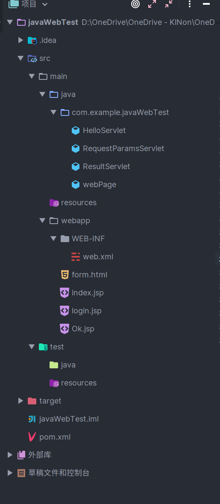
## pom.xml
```
<?xml version="1.0" encoding="UTF-8"?>
<project xmlns="http://maven.apache.org/POM/4.0.0" xmlns:xsi="http://www.w3.org/2001/XMLSchema-instance"
         xsi:schemaLocation="http://maven.apache.org/POM/4.0.0 http://maven.apache.org/xsd/maven-4.0.0.xsd">
    <modelVersion>4.0.0</modelVersion>

    <groupId>com.example</groupId>
    <artifactId>javaWebTest</artifactId>
    <version>1.0-SNAPSHOT</version>
    <name>javaWebTest</name>
    <packaging>war</packaging>

    <properties>
        <maven.compiler.target>1.8</maven.compiler.target>
        <maven.compiler.source>1.8</maven.compiler.source>
        <junit.version>5.7.0</junit.version>
    </properties>

    <dependencies>
        <dependency>
            <groupId>javax.servlet</groupId>
            <artifactId>javax.servlet-api</artifactId>
            <version>4.0.1</version>
            <scope>provided</scope>
        </dependency>
        <dependency>
            <groupId>org.junit.jupiter</groupId>
            <artifactId>junit-jupiter-api</artifactId>
            <version>${junit.version}</version>
            <scope>test</scope>
        </dependency>
        <dependency>
            <groupId>org.junit.jupiter</groupId>
            <artifactId>junit-jupiter-engine</artifactId>
            <version>${junit.version}</version>
            <scope>test</scope>
        </dependency>
    </dependencies>

    <build>
        <plugins>
            <plugin>
                <groupId>org.apache.maven.plugins</groupId>
                <artifactId>maven-war-plugin</artifactId>
                <version>3.3.0</version>
            </plugin>
            <plugin>
                <groupId>org.eclipse.jetty</groupId>
                <artifactId>jetty-maven-plugin</artifactId>
                <version>9.4.5.v20170502</version>
            </plugin>
        </plugins>
    </build>
</project>
```
### 2. Servlet的用法：使用IDEA新建Maven Web工程，新建一个Servlet，在客户端输出 Hello World，跟踪生命周期三个阶段，理解注解工作原理。

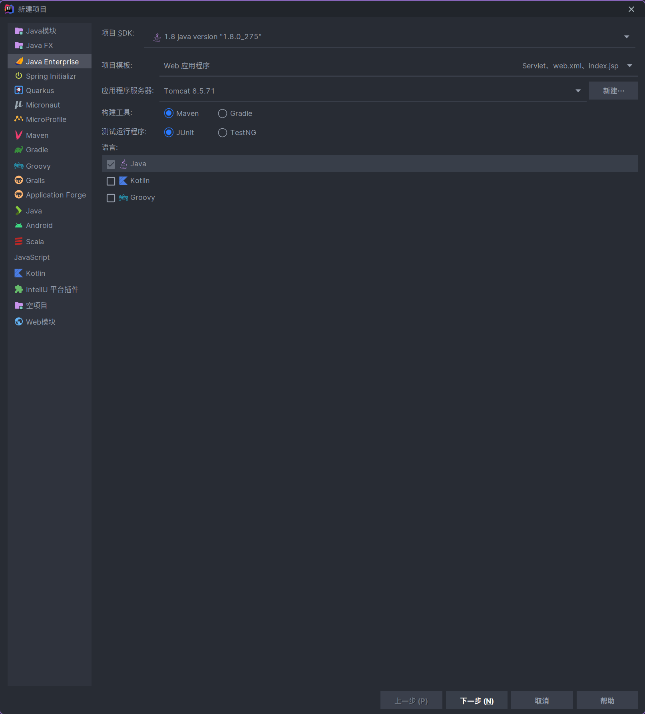
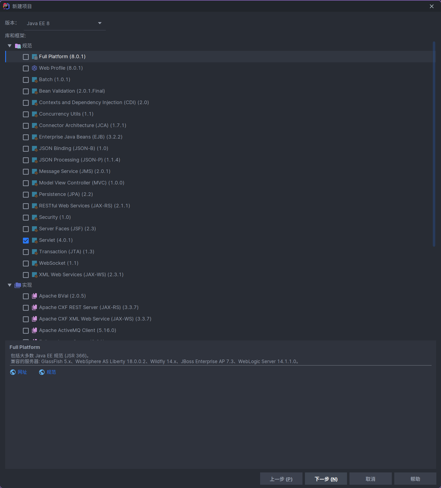
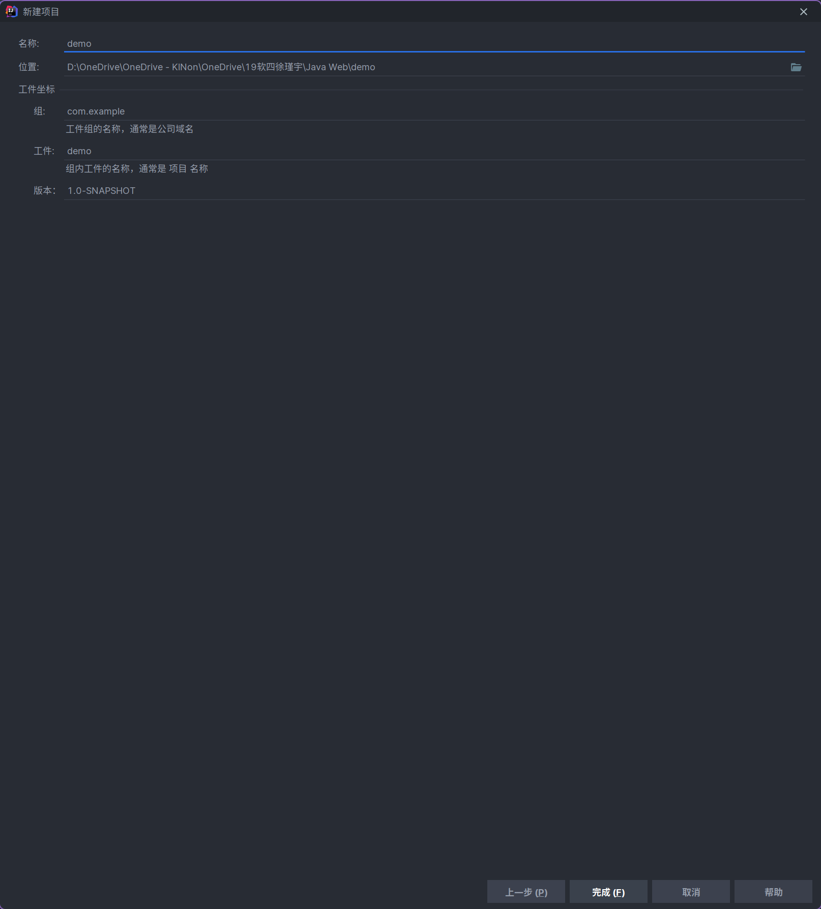
```java
package com.example.WebTest;

import java.io.*;
import javax.servlet.http.*;
import javax.servlet.annotation.*;

@WebServlet(name = "helloServlet", value = "/hello-servlet")//web服务器名称 和 地址值
public class HelloServlet extends HttpServlet {//继承自自带的HttpServlet
    private String message;
    // 初始化调用init()方法
    public void init() {
        message = "Hello World! 你好_世界。";
    }

    //service()方法为实际执行时所使用的方法，在接受请求后回应
    //当服务器接受到请求时，根据HTTP请求的类型调用相关方法
    @Override
    public void service(ServletRequest req, ServletResponse res) throws ServletException, IOException {
        super.service(req, res);
    }

    //当get请求发送后
    public void doGet(HttpServletRequest request, HttpServletResponse response) throws IOException {

        response.setContentType("text/html;charset=gb2312");//文本格式为HTML,输出字符集为GB2312

        // Hello,是网页的代码,获得响应的内容
        PrintWriter out = response.getWriter();
        out.println("<html><body>");
        out.println("<h1>" + message + "</h1>");
        out.println("</body></html>");
    }

    //在生命周期结束之后调用该方法回收资源
    public void destroy() {
    }
}
```
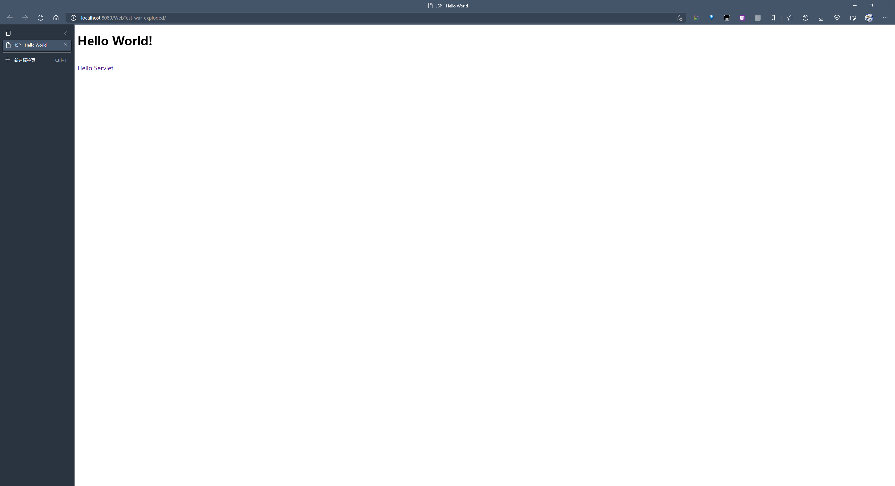

### 3. HttpServletRequest、HttpServletResponse的用法：解决中文乱码问题
```java
//response.setContentType("text/html;charset=utf-8");可以解决中文问题,
public void doGet(HttpServletRequest request, HttpServletResponse response) throws IOException {

        response.setContentType("text/html;charset=utf-8");//文本格式为HTML,输出字符集为UTF-8

        // Hello,是网页的代码,获得响应的内容
        PrintWriter out = response.getWriter();
        out.println("<html><body>");
        out.println("<h1>" + message + "</h1>");
        out.println("</body></html>");
    }


```
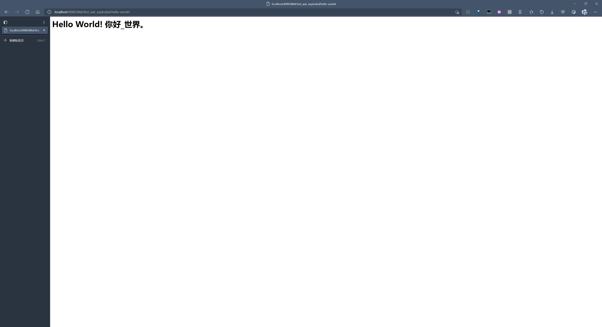

### 4. RequestDispatcher的用法：请求重定向、RequestDispatcher实现请求转发并利用request传递数据，获取请求参数
#### 重定向
```java
/*文件4-12、4-13、4-14*/
//webPage.java
@WebServlet(name = "webPage", value = "/webpage")
public class webPage extends HttpServlet {


    @Override
    protected void doGet(HttpServletRequest request, HttpServletResponse response) throws ServletException, IOException {
        response.setContentType("text/html;charset=gb2312");//文本格式为HTML,输出字符集为GB2312
//        request.getRequestDispatcher("/login.jsp").forward(request,response);
        String userName = request.getParameter("userName");
        String password = request.getParameter("password");
        System.err.println(userName+";"+password);
        String myUser = "root";
        String myPwd = "123456";
        System.err.println("aaa"+userName.equals(myUser)+";"+password.equals(myPwd));
        PrintWriter out = response.getWriter();
        if(userName.equals(myUser)&&password.equals(myPwd)) {
            System.err.println("success");
            response.sendRedirect("Ok.jsp");
        }else {
            System.err.println("defeat");
            out.println("登陆失败");
            request.getRequestDispatcher("login.jsp").include(request, response);

        }
    }

    @Override
    protected void doPost(HttpServletRequest req, HttpServletResponse resp) throws ServletException, IOException {
        doGet(req, resp);
    }

    public void destroy() {
        super.destroy();
    }
}
```
```javascript
//login.jsp
<%@ page contentType="text/html;charset=UTF-8" language="java" %>
<html>
<head>
    <meta http-equiv="Content-Type" content="text/html; charset=UTF-8">
    <title>标题</title>
    <style type="text/css">
        *{margin: 0;padding: 0;}
        form{margin: 0 auto;padding:15px; width: 300px;height:300px;text-align: center;}
        #submit{padding: 10px}
        #submit input{width: 50px;height: 24px;}
    </style>
</head>
<body>
<div class="wrapper">
    <form action="webpage" method="post">
        <label>用户名:<input type="text" name="userName" value="${param.userName}"/><br><br></label>

        <label>密码：<input type="password" name="password"/><br></label>

        <div id="submit">
            <input type="submit" value="登录"/>
        </div>
    </form>

</div>
</body>


//Ok.jsp
<%@ page contentType="text/html;charset=UTF-8" language="java" %>
<html>
<head>
    <title>Ok</title>
</head>
<body>
<h1><%= "OK,登录成功!" %>
</body>
</html>
```

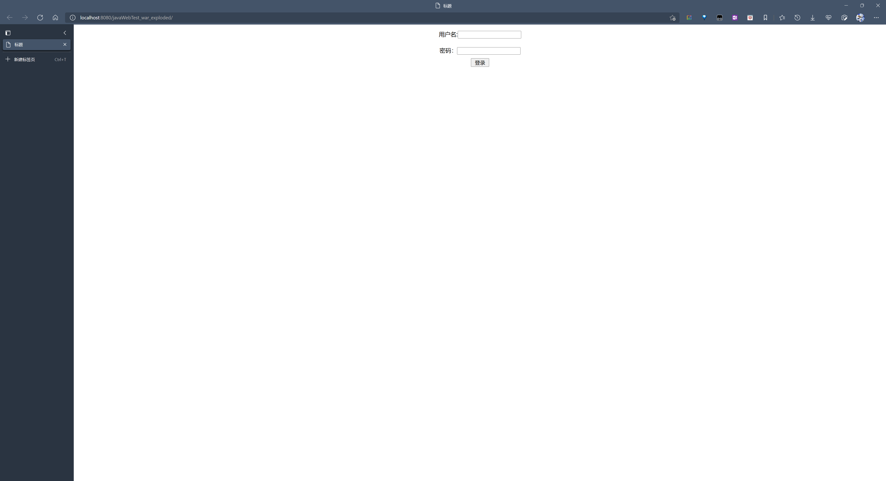
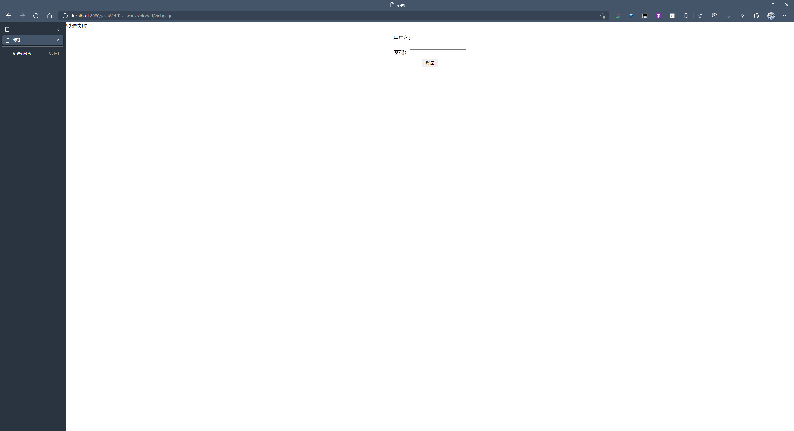
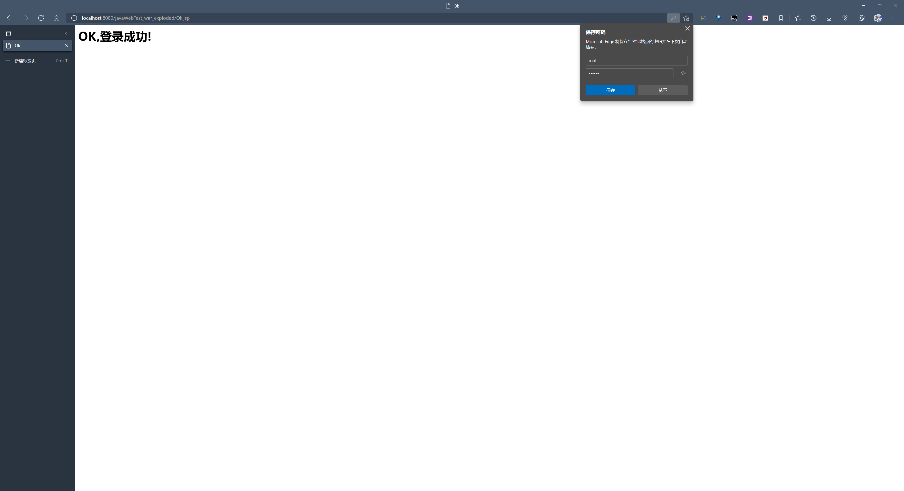

#### 利用request传递数据
```java
@WebServlet(name = "webPage", value = "/webpage")
public class webPage extends HttpServlet {


    @Override
    protected void doGet(HttpServletRequest request, HttpServletResponse response) throws ServletException, IOException {
        response.setContentType("text/html;charset=utf-8");//文本格式为HTML,输出字符集为GB2312
        String userName = request.getParameter("userName");
        String password = request.getParameter("password");
        System.err.println(userName+";"+password);
        String myUser = "root";
        String myPwd = "123456";
        System.err.println("账号验证"+userName.equals(myUser)+";"+password.equals(myPwd));
        PrintWriter out = response.getWriter();
        if(userName.equals(myUser)&&password.equals(myPwd)) {
            System.err.println("success");
            request.setAttribute("username",userName);

//            response.sendRedirect("ResultServlet");//这个再定向会丢失数据,不能利用request传输数据
            request.getRequestDispatcher("ResultServlet").include(request, response);//这个再定向不会丢失数据,可以向后面传数据

        }else {
            System.err.println("defeat");
            out.println("登陆失败");
            //.include(request, response)将这个包含的资源（JSP,Servlet，HTML）的响应数据包含到自己的响应体中。被包含的数据是在服务器上经过运行产生的，因此是动态包含
            request.getRequestDispatcher("login.jsp").include(request, response);//不会丢失数据,且再定向后输入栏有数据
//            request.getRequestDispatcher("login.jsp").forward(request, response);//不会丢失数据,再定向后输入栏无数据
//            两者都可以利用request传数据
        }
    }

    @Override
    protected void doPost(HttpServletRequest req, HttpServletResponse resp) throws ServletException, IOException {
        doGet(req, resp);
    }

    public void destroy() {
        super.destroy();
    }
}

```

```java
@WebServlet(name = "ResultServlet", value = "/ResultServlet")
public class ResultServlet extends HttpServlet {
    @Override
    protected void doGet(HttpServletRequest request, HttpServletResponse response) throws ServletException, IOException {
        response.setContentType("text/html;charset=utf-8");
        PrintWriter out =response.getWriter();
        String username = (String) request.getAttribute("username");
        if(username!=null){
            out.println("<html><body><h2>");
            out.println("欢迎用户名: "+username +"<br/>");
            out.println("<h2><body><html>");
        }
    }

    @Override
    protected void doPost(HttpServletRequest request, HttpServletResponse response) throws ServletException, IOException {
        doGet(request,response);
    }
}
```
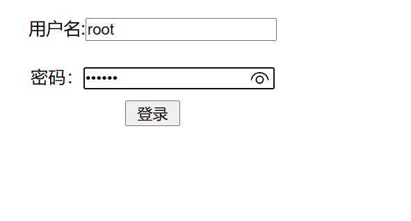
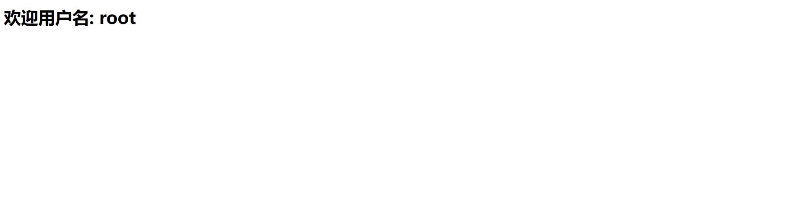
#### 在控制台显示内容
```html
<!DOCTYPE html>
<html>
<head>
    <meta http-equiv="Content-Type" content="text/html"; charset="UTF-8">
    <title>标题</title>
</head>
<body>
<form action="RequestParamsServlet" method="POST">
    用户名:<input type="text" name="username"><br/>
    密&nbsp;&nbsp;&nbsp;码: <input type="password" name="password">
    <br/>
    爱好:
    <input type="checkbox" name="hobby" value="sing">唱歌
    <input type="checkbox" name="hobby" value="dance">跳舞
    <input type="checkbox" name="hobby" value="football">足球<br/>
    <input type="submit" value="提交">
</form>
</body>
</html>
```

```java
@WebServlet(name = "RequestParamsServlet",urlPatterns = "/RequestParamsServlet")
public class RequestParamsServlet extends HttpServlet {
    @Override
    protected void doGet(HttpServletRequest req, HttpServletResponse resp) throws ServletException, IOException {
        req.setCharacterEncoding("utf-8");//设置回传文字的编码为UTF-8
        String name = req.getParameter("username");//关联到form.html的部件
        String password = req.getParameter("password");//关联到form.html的部件
        System.out.println("用户名:"+name);
        System.out.println("密码:"+password);
        String[] hobbys = req.getParameterValues("hobby");
        System.out.print("爱好:");
        for(int i=0;i<hobbys.length;i++){
            System.out.print(hobbys[i] + ",");
        }
    }

    @Override
    protected void doPost(HttpServletRequest req, HttpServletResponse resp) throws ServletException, IOException {
        doGet(req,resp);
    }
}
```
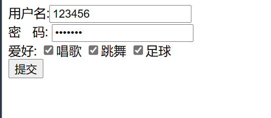
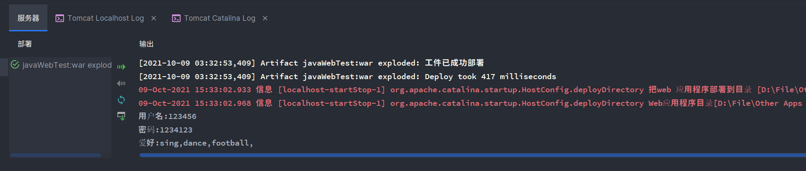
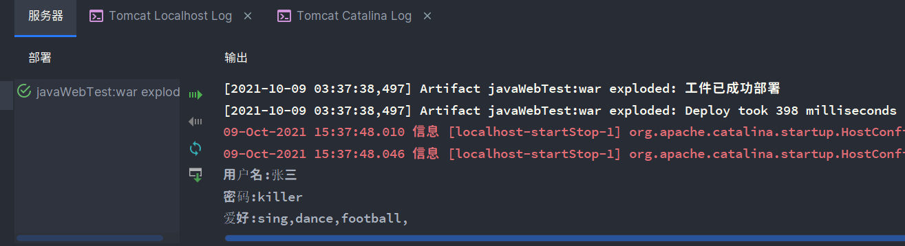
### 5. Cookie的用法：显示用户上次访问时间
```java
@WebServlet(name = "LastAccessServlet", value = "/LastAccessServlet")
public class LastAccessServlet extends HttpServlet {
    @Override
    protected void doGet(HttpServletRequest request, HttpServletResponse response) throws ServletException, IOException {
        response.setContentType("text/html;charset=utf-8");//指定编码方式为UTF-8,防止乱码
        Cookie[] cookies= request.getCookies();//获得所有cookie
        boolean flag=false;//判断cookie是否为空
        if(cookies.length >0&&cookies!=null)
        {
            for(Cookie cookie:cookies){//遍历cookie
                String name=cookie.getName();//获取cookie名字
                if("lastTime".equals(name)){//判断是否是选中的cookie
                    flag=true;//该cookie不是第一次访问
                    String value=cookie.getValue();//获取上次的响应时间
                    System.out.println("解码前:"+value);//在控制面板输出时间
                    value= URLDecoder.decode(value,"utf-8");//URL解码
                    System.out.println("解码后:"+value);//控制面板输出
                    response.getWriter().write("WelcomeBack,您上次方位时间"+"为:"+value);//在网页显示时间
                    //获取当前时间的字符串,重新设置cookie的值,重新发送cookie
                    Date date=new Date();
                    SimpleDateFormat timesdf=new SimpleDateFormat("yyyy年MM"+"月dd日 HH:mm:ss");
                    String str_time=timesdf.format(date);
                    System.out.println("编码前: "+str_time);
                    str_time= URLEncoder.encode(str_time,"utf-8");//URL编码
                    System.out.println("编码前: "+str_time);
                    cookie.setValue(str_time);
                    cookie.setMaxAge(60*60*24*30);//设置cookie的存活时间为一个月
                    //加入当前cookie的请求时间
                    response.addCookie(cookie);
                    break;
                }
            }

            //如果cookie中无时间,则未访问过,就需要添加cookie
            if(cookies==null||cookies.length==0||flag==false){
                //获取当前时间的字符串,重新设置cookie的值,重新发送cookie
                Date date =new Date();
                SimpleDateFormat sdf=new SimpleDateFormat("yyyy年MM"+"月dd日 HH:mm:ss");
                String str_date=sdf.format(date);
                System.out.println("编码前: "+str_date);
                str_date= URLEncoder.encode(str_date,"utf-8");
                System.out.println("编码前: "+str_date);
                Cookie cookie=new Cookie("lastTime",str_date);
                cookie.setMaxAge(60*60*24*30);
                response.addCookie(cookie);
                response.getWriter().write("您好,欢迎访问");
            }
        }
    }

    @Override
    protected void doPost(HttpServletRequest request, HttpServletResponse response) throws ServletException, IOException {
        doGet(request,response);
    }
}
```


### 6. Session的用法：Session实现用户登录、实现购物车
``` java
/*文件5-2、文件5-3、文件5-4、文件5-5、文件5-6*/
//5-2
public class Cake {
    private static final long serialVersionUID=1L;
    private String id;
    private String name;
    public Cake(){
    }
    public Cake(String id,String name){
        this.id=id;
        this.name=name;
    }

    public String getId() {
        return id;
    }

    public void setId(String id) {
        this.id = id;
    }

    public String getName() {
        return name;
    }

    public void setName(String name) {
        this.name = name;
    }
}

//5-3
public class CakeDB {
    private static Map<String, Cake> cake = new LinkedHashMap<String,Cake>();
    static {//预先生成对象
        cake.put("1",new Cake("1","A类蛋糕"));
        cake.put("2",new Cake("2","B类蛋糕"));
        cake.put("3",new Cake("3","C类蛋糕"));
        cake.put("4",new Cake("4","D类蛋糕"));
        cake.put("5",new Cake("5","E类蛋糕"));
    }
    public static Collection<Cake> getAll(){
        return cake.values();
    }//获取所有的Cake对象的数据
    public static Cake getCake(String id){
        return cake.get(id);
    }//获得单个Cake对象的数据
}


//5-4
@WebServlet(name = "ListCakeServlet", value = "/ListCakeServlet")
public class ListCakeServlet extends HttpServlet {
    @Override
    protected void doGet(HttpServletRequest request, HttpServletResponse response) throws ServletException, IOException {
        response.setContentType("text/html;charset=utf-8");//设置中文编码
        PrintWriter out=response.getWriter();
        Collection<Cake> cakes=CakeDB.getAll();//获得所有蛋糕对象
        out.write("本店提供以下蛋糕:<br>");//列出所有蛋糕对象
        for(Cake cake:cakes){
            String url= "PurchaseServlet?id="+cake.getId();//
            out.write(cake.getName()+"<a href='"+url+"'>点击购买</a><br>");
        }
    }

    @Override
    protected void doPost(HttpServletRequest request, HttpServletResponse response) throws ServletException, IOException {
        doGet(request, response);
    }
}

//5-5
@WebServlet(name = "PurchaseServlet", value = "/PurchaseServlet")
public class PurchaseServlet extends HttpServlet {
    @Override
    protected void doGet(HttpServletRequest request, HttpServletResponse response) throws ServletException, IOException {
        String id = request.getParameter("id");
        if(id==null){
            String url="ListCakeServlet";
            response.sendRedirect(url);//重定向
            return;
        }
        Cake cake = CakeDB.getCake(id);
        //创建或获得用户Session对象
        HttpSession session=request.getSession();
        List cart = (List) session.getAttribute("cart");
        if(cart==null){
            cart=new ArrayList<Cake>();
            session.setAttribute("cart",cart);
        }
        cart.add(cake);
        Cookie cookie=new Cookie("JSESSIONID",session.getId());
        cookie.setMaxAge(60*30);
        cookie.setPath("/Servlet");
        response.addCookie(cookie);
        response.sendRedirect("CartServlet");
    }

    @Override
    protected void doPost(HttpServletRequest request, HttpServletResponse response) throws ServletException, IOException {

    }
}


//5-6
@WebServlet(name = "CartServlet", value = "/CartServlet")//购物车Servlet
public class CartServlet extends HttpServlet {
    @Override
    protected void doGet(HttpServletRequest request, HttpServletResponse response) throws ServletException, IOException {
        response.setContentType("text/html;charset=utf-8");//设置中文编码
        PrintWriter out=response.getWriter();
        List<Cake> cart=null;//引用购物车队列
        boolean pruFlag=true;//确认购物车内是否有物品
        HttpSession session=request.getSession(false);
        if(session==null){
            pruFlag=false;
        }else {
            //获得用户购物车
            cart=(List) session.getAttribute("cart");
            if(cart==null)//如果购物车为空,则标记为false
                pruFlag=false;
        }
        if(!pruFlag){//对购物车情形做出具体行为
            out.write("您尚未购买任意商品.<br>");
        }else {
            //列出购物车内内容
            out.write("您购买的商品有:<br>");
            double price=0;
            for(Cake cake:cart){
                out.write(cake.getName()+"<br>");
            }
        }
    }

    @Override
    protected void doPost(HttpServletRequest request, HttpServletResponse response) throws ServletException, IOException {
        doGet(request, response);
    }
}

```
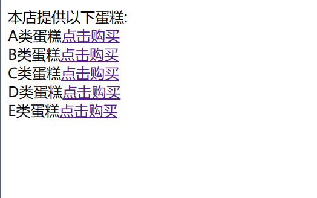
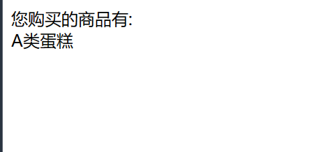
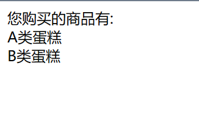

```java
/*文件5-7、文件5-8、文件5-9、文件5-10、文件5-11*/
//5-7
public class User {
    private String username;
    private String password;

    public String getUsername() {
        return username;
    }

    public void setUsername(String username) {
        this.username = username;
    }

    public String getPassword() {
        return password;
    }

    public void setPassword(String password) {
        this.password = password;
    }
}

//5-8
@WebServlet(name = "IndexServlet", value = "/IndexServlet")
public class IndexServlet extends HttpServlet {
    @Override
    protected void doGet(HttpServletRequest request, HttpServletResponse response) throws ServletException, IOException {
        response.setContentType("text/html;charset=utf-8");
        HttpSession session=request.getSession();
        User user=(User) session.getAttribute("user");
        if(user==null){
            response.getWriter().print("未登录,请<a href='/login.html'>登录</a>");
        }else {
            response.getWriter().print("欢迎:"+user.getUsername()+".</br>");
            response.getWriter().print("查询上次登录时间,<a href='/LastAccessServlet'>查询</a></br>");
            response.getWriter().print("<a href='LogoutServlet'>退出</a>");
            Cookie cookie=new Cookie("JSESSIONID",session.getId());//获取session自动创建的id后放入cookie
            cookie.setMaxAge(60*30);
            cookie.setPath("/");
            response.addCookie(cookie);
        }
    }

    @Override
    protected void doPost(HttpServletRequest request, HttpServletResponse response) throws ServletException, IOException {
        doGet(request, response);
    }
}

//5-9
@WebServlet(name = "LoginServlet", value = "/LoginServlet")
public class LoginServlet extends HttpServlet {
    @Override
    protected void doGet(HttpServletRequest request, HttpServletResponse response) throws ServletException, IOException {
        response.setContentType("text/html;charset=utf-8");
        String userName = request.getParameter("userName");
        String password = request.getParameter("password");
        PrintWriter pw = response.getWriter();
        System.err.println(userName+";"+password);
        if("root".equals(userName)&&"123".equals(password)) {
            User user=new User();
            user.setUsername(userName);
            user.setPassword(password);
            request.getSession().setAttribute("user",user);
            response.sendRedirect("/IndexServlet");
        }else {
            pw.write("登陆失败,用户名或密码错误.");
        }
    }

    @Override
    protected void doPost(HttpServletRequest request, HttpServletResponse response) throws ServletException, IOException {
        doGet(request, response);
    }
}


//5-10
@WebServlet(name = "LogoutServlet", value = "/LogoutServlet")
public class LogoutServlet extends HttpServlet {
    @Override
    protected void doGet(HttpServletRequest request, HttpServletResponse response) throws ServletException, IOException {
        request.getSession().removeAttribute("user");
        response.sendRedirect("/IndexServlet");
    }

    @Override
    protected void doPost(HttpServletRequest request, HttpServletResponse response) throws ServletException, IOException {
        doGet(request, response);
    }
}

```
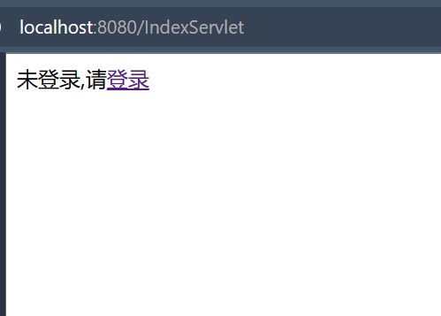
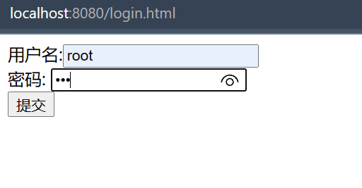
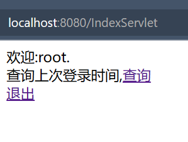
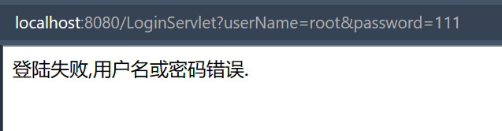

### 7. JSP的用法：用JSP技术重写书城首页、注册页面
```java
/*文件6-17、文件6-18*/

```


```java
/*文件6-19、文件6-20、文件6-21*/

```

### 8. EL和JSTL：用JSTL标签循环输出集合内容。
```java
/*文件7-14、文件7-15*/

```

### 9. JavaBean的用法：在JSP中使用JavaBean，判断用户名是否有效。
```java
/*文件8-15、文件8-16、文件8-17*/

```


### 10. MVC模式：按照Model2思想实现用户注册功能
```java
/*文件8-18、文件8-19、文件8-20、文件8-21、文件8-22、文件8-23*/

```


### 11. JDBC：使用JDBC完成数据的增删改查
```java
/*文件10-4、文件10-5、文件10-6、文件10-7、文件10-8、文件10-9、文件10-10*/

```


### 12. Ajax
#### 1). 使用jQuery操作DOM
jQuery是一个Javascript框架，一个轻量级Javascript库，封装了css选择器，操作DOM的方法及jQuery事件等。
+ DOM(Document Object Model)是表示和处理一个HTML文档的模型，即树形结构，每个html元素都是DOM树的节点，操作节点，使得用户页面可以动态发生改变。
+ 大多数DOM事件都有一个等效的jQuery方法。比如ready()方法加载页面，在DOM加载完毕就会触发。常用的写法是 `$(function(){})`
+ 语法：`$(selector).action()`
+ 例子
过滤选择器（：开始），如`:nth-child(odd)`选择父元素下奇元素。`:checked`选择表单元素其属性值为checked的；`:not(selector)`选择“去除所有与给定选择器匹配的元素”。

```html
<!--图片预览与数据删除应用-->
<html>
	<head>
		<title>图片预览与数据删除应用</title>
		<script src="jquery-3.6.0.min.js"></script>
		<style type="text/css">
			table{width:360px; border-collapse: collapse;text-align: center;font-size: 12px;}
			table th,td{border: solid 1px #666;}
			table span{float:left;padding-left: 12px;}
			table th{background-color: #ccc; height: 32px;}
			table img{border:solid 1px #ccc; padding:3px; width:42px; height: 60px;}
			.clsImg{position:absolute; border:solid 1px #ccc; padding:3px;width:85px;height:120px;display: none;}
		</style>
		<script type="text/javascript">
			$(function(){
				$("table tr:nth-child(odd)").css("background-color","#eee");//隔行变色
				//全选复选框单击事件
				$("#chkAll").click(function(){
					$("table tr td input[type=checkbox]").attr("checked",this.checked);
				})
				/*删除按钮单击事件*/
				$("#btnDel").click(function(){
					var intL = $("table tr td input:checked:not('#chkAll')").length;
					if(intL != 0){
						$("table tr td input[type=checkbox]:not('#chkAll')").each(function(index){
							if(this.checked){
								$("table tr[id=" + this.value + "]").remove();
							}
						})
					}
				})
				/*小图片鼠标移动事件*/
				var x=5,y=15;//初始化提示图片的位置
				$("table tr td img").mouseover(function(e){
					$("#imgTip").attr("src",this.src)
								.css({"top":(e.pageY + y)+"px",//设置提示图片的位置
									  "left":(e.pageX + x)+"px"
									  }).show(2000);
								
				})
				$("table tr td img").mouseout(function(){
					$("#imgTip").hide();
				})
			})
		</script>
	</head>
	<body>
		<table>
			<tr><th>选项</th><th>编号</th><th>封面</th><th>购书人</th><th>性别</th><th>单价</th></tr>
			<tr id="1">
				<td><input id="checkbox1" type="checkbox" value="1"</td>
				<td>1001</td><td></td>
				<td>张三</td><td>男</td><td>35.6</td>
			</tr>
			<tr id="2">
				<td><input id="checkbox2" type="checkbox" value="2"</td>
				<td>1002</td><td></td>
				<td>李四</td><td>男</td><td>36.6</td>
			</tr>
			<tr id="3">
				<td><input id="checkbox3" type="checkbox" value="3"</td>
				<td>1003</td><td></td>
				<td>王五</td><td>男</td><td>37.6</td>
			</tr>
		</table>
		<table>
			<tr>
				<td style="text-align:left;height:28px;">
					<span><input id="chkAll" type="checkbox"/>全选</span>
					<span><input id="btnDel" type="button" value="删除" class="btn"/></span>
				</td>
			</tr>
		</table>
		
	</body>
</html>
```
+ 效果图


#### 2). Ajax编程技术
###### a)XMLHttpRequest对象：由JavaScript创建
###### b)XLMHttpRequest的方法和属性
###### c)Ajax开发的处理步骤
+ 创建XMLHttpRequest对象
+ 从Web表单中获取数据
+ 设置url
+ 建立到服务器的连接
+ 设置服务器返回数据后浏览器端运行的回调函数
+ 发送请求
+ 在回调函数中，获取服务器的响应数据（text或xml）并显示。

```html
<!--实现级联列表-->
<!DOCTYPE HTML PUBLIC "-//W3C//DTD HTML 4.01 Transitional//EN"
        "http://www.w3.org/TR/html4/loose.dtd">
<html>
<head>
    <meta charset="utf-8">
    <title>实现级联列表</title>
    <script type="text/javascript" src="js/ajax.js"></script>
    <script type="text/javascript">
        function refresh(){
            var p = document.getElementById("prov").value;
            var city = document.getElementById("city");
            if(p==""){
                city.options.length=0;
                city.options.add(new Option("--请选择城市--"));
            }else{
            var url = "list";
            var params = "prov="+ p;
            sendRequest(url,params,'post',show);
                            
        }
        }

        function show(){
            var city = document.getElementById("city");
            if(httpRequest.readyState==4){
                if(httpRequest.status == 200){
                    var citylist = httpRequest.responseText.split(",");
                    var citynum = citylist.length;
                    city.options.length=0;
                    for(i=0;i<citynum;i++)
                        city.options.add(new Option(citylist[i]));
               }
            }
        }
    </script>
</head>
<body>
    <form action="">
        省份：<select name="prov" id="prov" onchange="refresh()">
                <option value="">--请选择城市--</option>
                <option value="山东">山东</option>
                <option value="江苏">江苏</option>
                <option value="广东">广东</option>
                </select>
        城市：<select name="city" id="city">
                <option>--请选择城市--</option>
        </select>
    </form>
</body>
</html>
```
```java
package com.dxj.controller;

import javax.servlet.annotation.WebServlet;
import javax.servlet.http.HttpServlet;
import javax.servlet.http.HttpServletRequest;
import javax.servlet.http.HttpServletResponse;
import java.io.IOException;
import java.io.PrintWriter;
import java.util.HashMap;
import java.util.Map;

@WebServlet("/list")
public class CascadeList extends HttpServlet {
    public void doPost(HttpServletRequest req, HttpServletResponse resp) throws IOException {
        Map<String,String> pm = new HashMap<String,String>();
        pm.put("山东","济南,青岛,泰安,潍坊,烟台,聊城");
        pm.put("江苏","南京,苏州,无锡,徐州,南通,扬州");
        pm.put("广东","广州,深圳,珠海,汕头,佛山,中山");
        req.setCharacterEncoding("utf-8");
        resp.setCharacterEncoding("utf-8");
        resp.setContentType("text/html,charset='utf-8");
        PrintWriter out = resp.getWriter();
        String prov = req.getParameter("prov");
        out.println(pm.get(prov));
    }
}

```
效果图 


#### 3). JSON
+ JSON的基本结构
	- 对象：`{key1:value1,key2:value2,...}`,通过“`对象.key`”获取属性值，属性值可以是数值、字符串、数组、对象等。
	- 数组：`[]`，通过“`数组名[index]`"获取数组元素，元素类型可以是数值、字符串、数值、对象等。
	经过对象和数值两种结构的嵌套可以组成更复杂的数据结构。
+ 在Javascript中使用JSON：JSON是JavaScript的原生格式，不需要特殊的工具包。当服务器端返回JSON字符串时，浏览器端需要将JSON字符串(有"")转换为JSON对象(无"")，常用方法：`JSON.parse(JsonStr)`.
+ Java对象与JSON的转化
	- pom.xml 增加 fastjson依赖。

```xml
<dependency>
      <groupId>com.alibaba</groupId>
      <artifactId>fastjson</artifactId>
      <version>1.2.58</version>
</dependency>
```
- 常用方法

```java
//Java对象转换成String类型的JSON字符串
JSONObject.toJSONString(Java对象)
 //String类型的JSON字符串转换成Java对象
JSONObject.toJavaObject(JSON字符串,Java对象.class)
 //Json字符串转换成JSONObject对象
JSONObject.parseObject(JSON字符串)
 //JSON字符串转换成Java对象
JSONObject.parseObject(JSON字符串,Java对象.class)
```

#### 4). jQuery框架中的Ajax方法
+ post方法：以post方式从服务器请求数据。格式为：`$.post(url,data,callback)`
+ 例子：基于Ajax+jQuery的添加表格记录

```html
<!DOCTYPE html>
<html lang="en">
<head>
    <meta charset="UTF-8">
    <title>基于ajax+jquery的记录添加</title>
    <script src="js/jquery-3.6.0.min.js"></script>
    <script>
        function add(){
            $.post("add",$("#form1").serialize(),function(data){
                $("#result").text(data);
            });
        }
    </script>
</head>
<body>
    <form id="form1" method="post">
        username:<input type="text" name="userName" id="userName" />
        password:<input type="password" name="password" id="password"/>
        <input type="button" value="添加记录" onclick="add()" />
      </form>
<div id="result"></div>
</body>
</html>
```
```java
package com.dxj.controller;

import com.alibaba.fastjson.JSON;
import com.dxj.po.Student;
import com.dxj.po.UserInfo;

import javax.servlet.annotation.WebServlet;
import javax.servlet.http.HttpServlet;
import javax.servlet.http.HttpServletRequest;
import javax.servlet.http.HttpServletResponse;
import java.io.IOException;
import java.io.PrintWriter;
import java.util.ArrayList;
import java.util.List;

@WebServlet("/add")
public class Add extends HttpServlet {
    public void doPost(HttpServletRequest req, HttpServletResponse resp) throws IOException {
        req.setCharacterEncoding("utf-8");
        resp.setCharacterEncoding("utf-8");
        resp.setContentType("text/html,charset='utf-8");

        String userName = req.getParameter("userName");
        String password = req.getParameter("password");
        UserInfo userInfo = new UserInfo();
        userInfo.setUserName(userName);
        userInfo.setPassword(password);

        //fastjson中 List 转 JSONArray
        PrintWriter out = resp.getWriter();
        out.print(JSON.toJSONString(userInfo));
    }
}
```

+ $.post()提交表单：

```html
<!DOCTYPE HTML PUBLIC "-//W3C//DTD HTML 4.01 Transitional//EN" "http://www.w3.org/TR/html4/loose.dtd">
<meta content-type="text/html" charset="utf-8">

<head>
  <!-- <script src="js/jquery-3.6.0.min.js"></script> -->
  <script src="https://cdn.bootcdn.net/ajax/libs/jquery/3.6.0/jquery.min.js"></script>
  <script type="text/javascript">
    // 脚本在html前面的话，需要把访问dom元素的代码放到 `$().ready()` 里面，不然访问不到元素
    $().ready(() => {
      // 这里不是查找提交按钮，而是查找表单
      $("#loginForm").submit((evt) => {
        $.post("user/login",
          {
            // 这些通过 id 查找文本框，但对应的文本框没有指明id
            userName: $("#userName").val(),
            password: $("#password").val()
          },
          function (data, status) {
            alert(status);
          });

        // 这代码是必需的，不然html form会自动提交
        evt.preventDefault();
      });
    })
  </script>
</head>

<body>
  <h2>login</h2>
  <form id="loginForm" method="post">
    username:<input type="text" name="userName" id="userName" />
    password:<input type="password" name="password" id="password"/>
    <input type="submit" id="submit" value="login" />
  </form>
</body>

</html>
```

#### 5). 实时显示公告信息

```java
/*文件12-12、文件12-13、文件12-14、文件12-15*/
```
![运行结果截图1...N](