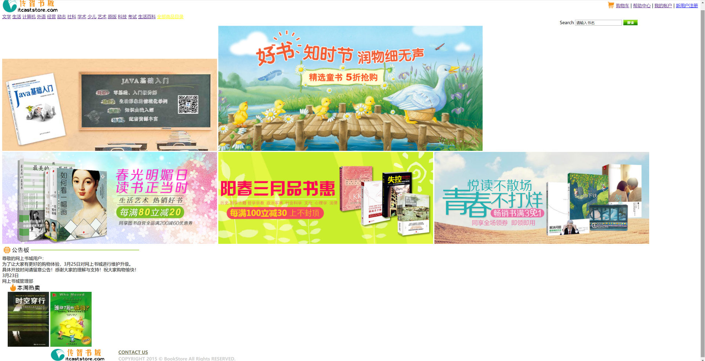

# 实验一：Web客户端技术
## 一．	实验目的
1. 掌握Dreamweaver、Code等工具的使用
2. 熟悉HTML的常用标记
3. 熟悉CSS选择器和常用属性
4. 掌握HTML+CSS+JavaScript的开发基础

## 二．	实验类型：验证型

## 三．	实验学时：8学时

## 四．	实验原理及知识点
1. HTML的常用标记包括文字与段落，建立列表，图片及多媒体文件的使用，建立超链接，建立表单页面
2. 页面的布局
3. 样式语法，样式属性，样式类
4. 脚本语言语法，HTML DOM模型，事件响应模型。

## 五．实验环境（硬件环境、软件环境）
1. 硬件环境：微型电子计算机Intel Pentium 4 CPU 1.2GHz，512MB RAM及以上
2. 软件环境：
操作系统：Windows 7 以上
Web服务器：Tomcat 8 以上
软件工具：Eclipse 4 集成开发工具+ MySQL 5、Chrome浏览器

## 六．	实验内容及步骤
## 书城首页的实现（5分）
### 功能：
+ 布局（9月12日截止）
+ 菜单（9月19日截止）
+ 广告页轮播（9月19日截止）
### 效果图
+ HTML+CSS效果图:
+ 
+ 不使用CSS的效果图:
+ 
### 实现步骤
### 1.创建资源文件夹

### 2.布局
#### 1）写出HTML的分层各部分
```html
<!DOCTYPE html PUBLIC "-//W3C//DTD HTML 4.01 Transitional//EN" "http://www.w3.org/TR/html4/loose.dtd">
<html>

<head>
    <link href="../style/main.css" rel="stylesheet">
    <!-- 顶部的CSS文件 -->
    <link href="../style/divmenu.css" rel="stylesheet">
    <!-- 菜单的CSS文件 -->
    <link href="../style/autoplay.css" rel="stylesheet">
    <!-- 轮播图的CSS文件 -->
    <link href="../style/divfoot.css" rel="stylesheet">
    <!-- 底部的CSS文件 -->
    <link href="../style/divcontent.css" rel="stylesheet">
    <!-- 其它区域的CSS文件 -->
    <link href="../style/divsearch.css" rel="stylesheet">
    <!-- 搜索部分的CSS文件 -->

    <style type="text/css">
    </style>

    <meta http-equiv="Content-Type" content="text/html; charset=UTF-8">
    <title>首页</title>
</head>

<body class="main">
    <!-- 1.网上书城顶部 start -->
    <div id="divhead">
    </div>
    <!-- 网上书城顶部  end -->

    <!--2. 网上书城菜单列表  start -->
    <div id="divmenu">
    </div>
    <!-- 网上书城菜单列表  end -->

    <div id="divsearch">
    </div>
    <!-- 3.网上书城首页轮播图  start -->
    <div id="banner">
        <div id="box_autoplay">
        </div>
    </div>
    <!-- 网上书城首页轮播图  end -->

    <!--4. 公告板和本周热卖  start -->
    <div id="divcontent">
    </div>
    <!-- 公告板和本周热卖  end -->

    <!--5. 网上书城底部 start -->
    <div id="divfoot">
    </div>
    <!-- 网上书城底部  end -->
</body>

</html>
```
#### 2）为每个层布局，定义背景色和大小、定位（宽度、高度、框模型），局部通过table来设置位置
+ divhead 头部区域通过table布局，创建一行两列的表格。
```html
		<table style="width: 100%;" cellspacing="0" class="headtable">
        <!-- 宽设置为100%,使购物车那一栏向右靠齐 -->
            <tr>
                <td>
                    <a href="#">
                        
                    </a>
                </td>
                <!--此单元格样式靠右边对齐-->
                <td style="text-align:right;">
                    &nbsp;<a
                        href="#">购物车</a>
                    | <a href="#">帮助中心</a>
                    | <a href="#">我的帐户</a>
                    | <a href="register.html">新用户注册</a>
                </td>
            </tr>
        </table>

        + divmenu 菜单项布局
```html
  <div id="divmenu">
      <td style="width: 100%;">
          <a href="#">文学</a>
          <a href="#">生活</a>
          <a href="#">计算机</a>
          <a href="#">外语</a>
          <a href="#">经营</a>
          <a href="#">励志</a>
          <a href="#">社科</a>
          <a href="#">学术</a>
          <a href="#">少儿</a>
          <a href="#">艺术</a>
          <a href="#">原版</a>
          <a href="#">科技</a>
          <a href="#">考试</a>
          <a href="#">生活百科</a>
          <a style="color: yellow;" href="#">全部商品目录</a>
      </td>
  </div>

<!--main.css中设置的样式-->
#divhead {
	width: 100%;
}
#divhead a{
    <!-- 去除下划线 -->
	text-decoration: none;
}
.headtable td {
	padding: 10px 50px 25px 135px;
}
```

#divmenu {
    padding: 5px;
    text-align:center;
	width: 100%;
    background-color: #000000;
	}
```
+ divsearch  内部元素用table布局
```html
    <div id="divsearch">
        <form action="#" id="searchform">
            <table width="100%" border="0" cellspacing="0">
                <tr>
                    <!--样式中 右内边距定位-->
                    <td style="text-align:right; padding-right:220px">
                        Search
                        <input type="text" name="textfield" class="inputtable" id="textfield" value="请输入书名"
                            onmouseover="this.focus();" onclick="my_click(this, 'textfield');"
                            onBlur="my_blur(this, 'textfield');" />
                            <!-- 点击输入框的监听器 -->
                        <a href="#">
                            
                                <!-- 点击搜索按钮后进行搜索 -->
                        </a>
                    </td>
                </tr>
            </table>
        </form>
    </div>
```
+ box_autoplay
```html
<div id="banner">
        <div id="box_autoplay">
            <div class="list" id="images">
                <!-- 轮播图的广告页面 -->
                
                
                
                
                
            </div>
            <div class="btn" id="btns">
                <!-- 轮播图的5个随之变换的点,具体设置在CSS文件中 -->
                <span class></span>
                <span class></span>
                <span class></span>
                <span class></span>
                <span class></span>
                <div class="clear"></div>
            </div>
            <!-- javascript文件对轮播图的行为进行编写 -->
            <script src="../js/autoplay.js" async defer></script>
        </div>
    </div>
```
+ divcontent  内部元素用table布局
```html
#divcontent {
	width: 900px;
	background-color: #FCFDEF;
	border: 1px solid #EEEDDB;
	MARGIN-RIGHT: auto;
	MARGIN-LEFT: auto;
}
#divcontent .div{
	position: relative;
	width: auto;
	height: 250px;
    <!-- 250像素的高度保证高度不会覆盖 -->
}

//热卖榜的CSS文件
#divcontent .book{
	position: absolute;
	top: 0;
	right: 0;
	width: 400px;//热卖榜的宽度规定400像素,防止覆盖
	height: auto;
}

```
+ divfoot 内部元素用table布局
```html
#divfoot {
	width: 100%;
	clear: both;
	background-color: #efefef;
	margin-top: auto;
}
    <div id="divfoot">
        <table width="100%" border="0" cellspacing="0">
            <tr>
                <!-- rowspan合并多个列 -->
                <td rowspan="2" style="width:10%">
                    
                </td>
                <td style="padding-top:5px; padding-left:50px">
                    <a href="#">
                        <font color="#747556"><b>CONTACT US</b></font>
                    </a>
                </td>
            </tr>
            <tr>
                <td style="padding-left:50px">
                    <font color="#CCCCCC">
                        <b>COPYRIGHT 2015 &copy; BookStore All Rights RESERVED.</b>
                    </font>
                </td>
            </tr>
        </table>
    </div>
```

### 3. 菜单的实现（或用列表项实现）

>>锚伪类
在支持 CSS 的浏览器中，链接的不同状态都可以不同的方式显示，这些状态包括：活动状态，已被访问状态，未被访问状态，和鼠标悬停状态。
a:link {color: #FF0000}		/* 未访问的链接 */
a:visited {color: #00FF00}	/* 已访问的链接 */
a:hover {color: #FF00FF}	/* 鼠标移动到链接上 */
a:active {color: #0000FF}	/* 选定的链接 */

```html
<div id="divmenu">
        <td style="width: 100%;">
            <a href="#">文学</a>
            <a href="#">生活</a>
            <a href="#">计算机</a>
            <a href="#">外语</a>
            <a href="#">经营</a>
            <a href="#">励志</a>
            <a href="#">社科</a>
            <a href="#">学术</a>
            <a href="#">少儿</a>
            <a href="#">艺术</a>
            <a href="#">原版</a>
            <a href="#">科技</a>
            <a href="#">考试</a>
            <a href="#">生活百科</a>
            <a style="color: yellow;" href="#">全部商品目录</a>
        </td>
    </div>
    #divmenu a {
        text-decoration: none;//取消下划线
        font-weight: bold;
        font-size: 14px;
        color: #FFFFFF;
        padding: 10px 10px 10px 30px;
    }

    #divmenu a:link {
        font-weight: bold;
    }

    #divmenu a:visited {
        color: #FFFFFF;
    }

    #divmenu a:hover {
        color: #999999;
    }

    #divmenu a:active {
        color: #FFFFFF;
    }
```
### 4. 首页轮播图css和js
#### 轮播图的关键点
#### 1）position定位：这个属性定义建立元素布局所用的定位机制。
参看 https://developer.mozilla.org/zh-CN/docs/Web/CSS/position
任何元素都可以定位，不过绝对（absolute值）或固定元素会生成一个块级框，而不论该元素本身是什么类型。相对定位（relative值）元素会相对于它在正常流中的默认位置偏移。
+ relative值用于 box-autoplay 和 box-autoplay list 两个 div 层。其中 list 作为 其后的列表的容器，设置width、height为一张图片大小，`overflow：hidden`定义溢出元素内容区的内容会如何处理。hidden 值则列表的内容会被修剪，并且其余内容不可见。
+ absolute值：通过指定元素相对于最近的非 static 定位祖先元素的偏移，来确定元素位置。用于 box-autoplay list ul 元素，ul是一个无序表，包含5个列表项，其内容都是图片，每张图片大小`900px*335px`，默认列表项的`display：block`块级元素。因此整个ul的尺寸就是`900px*(335*5)px`。它的top初始值是为0。

```html
<!--index.html-->
    <div id="banner">
        <!-- banner用于规定其内部的控件位置居中 -->
        <div id="box_autoplay">
            <!-- box_autoplay用于使轮播图相对于它的绝对布局 -->
            <div class="list" id="images">
                <!-- list是宽度可以容纳5张图片的一个容器 -->
                
                
                
                
                
            </div>
            <div class="btn" id="btns">
                <!-- 设计按钮区域的样式和位置 -->
                <span class></span>
                <span class></span>
                <span class></span>
                <span class></span>
                <span class></span>
                <div class="clear"></div>
            </div>
            <!-- 引入轮播图的Javascript文件 -->
            <script src="../js/autoplay.js" async defer></script>
        </div>
    </div>

<!--autoplay.css-->
<!-- 预定义一些值方便使用和更改 -->
* {
    margin:0;
    padding:0;
    --imageWidth:900px;
    --height:335px;
}

.clear {
    clear:both;
}

#banner {
	text-align: center;
	margin:0 auto;
    width:calc(var(--imageWidth));
	padding: 10px;
}

#box_autoplay {
	position:relative;
	width:var(--imageWidth);
	height:var(--height);
	overflow: hidden;
	background:#fff;
}

<!-- 对包含所有按钮的块进行位置和大小上的定义 -->
#box_autoplay .btn{
	position: absolute;
	left: 36px;
	bottom: 12px;
	z-index: 2;
}

<!-- 对span进行定义,并且使它的样式为圆形 -->
#box_autoplay .btn span{
	display: inline-block;
    margin-left: 10px;
    width: 10px;
    height: 10px;
    border: 2px solid transparent;
    border-radius: 50%;
    vertical-align: middle;
    cursor: pointer;
    transition: all .2s;
}

#box_autoplay .list {
    position:absolute;
	left: 0px;
    z-index: 1;
    width:calc(var(--imageWidth)*5);
    height:var(--height);
    transition: all 1s;
}
<!-- 对list中的图片进行定义,让它们水平对齐,同时使它们的长宽一致 -->
#box_autoplay .list img {
	float:left;
    width:var(--imageWidth);
    height:var(--height);
}
```
#### 2）在js中完成的部分（详见autoplay.js的注释）
+ `circles`为按钮
+ 将上一个按钮样式变回来,这一个按钮样式被选中
+ 设置定时器 `timer`，每3秒将当前图片换为下一张。
+ 设置鼠标在轮播图上时的反应`addEventListener`。
```js
var multiImages = document.getElementById("images");//获取轮播图所有图片的信息
var circles = document.getElementById("btns").getElementsByTagName("span");//获取所有按钮的信息
var box = document.getElementById("box_autoplay");//获取轮播图块的信息
var currentIndex = 0;//当前展示的轮播图ID
var preIndex = 0;//上一次展示的轮播图ID
var timer = null;//自动切换

for (let i = 0; i < circles.length; i++) {//对所有的按钮进行初始化
    circles[i].style.backgroundColor="rgb(88, 186, 231)";//规定按钮初始颜色
    circles[i].setAttribute("id", i);//对5个按钮进行id赋值(从0到4)
    circles[i].addEventListener("mouseenter", overCircle);//增加监听器,当鼠标进入
}
//对自动轮播的设置进行初始化
timer = setInterval(nextMove, 3000);//设定延时3秒切换
box.addEventListener("mouseover", function () {
    clearInterval(timer);
    //在鼠标移动到按钮上时清除延时设定
});
box.addEventListener("mouseout", function () {
    timer = setInterval(nextMove, 3000);
    //在鼠标移出按钮上时继续延时设定
});
changeCircleColor(preIndex, currentIndex);//更改按钮的颜色(即初始的时候把按钮的颜色更新为选中状态,只用一次)

//鼠标移动到按钮上时
function overCircle() {
    preIndex = currentIndex;
    currentIndex = parseInt(this.id);//收集当前被选中按钮的id
    // multiImages.style.transition="1.5s";
    changeCircleColor(preIndex, currentIndex);//把被选中和上次选中的按钮的颜色改变
    moveImage();
}

//更改按钮颜色(选中按钮)
function changeCircleColor(preIndex, currentIndex) {
    circles[preIndex].style.backgroundColor="rgb(88, 186, 231)";//上一次选中的按钮的颜色改变回初始值
    circles[currentIndex].style.backgroundColor="rgb(255, 165, 0)";
}

//上一张轮播图
function preMove() {
    preIndex = currentIndex;
    if (currentIndex != 0) {//在当前轮播图播放到第一张的时候返回第五张(从后往前)
        currentIndex--;
    }
    else {
        currentIndex = 4;
    }
    changeCircleColor(preIndex, currentIndex);//改变按钮颜色
    moveImage();//改变当前图片
}

//下一张轮播图
function nextMove() {
    preIndex = currentIndex;
    if (currentIndex != 4) {//在当前轮播图播放到第五张的时候返回第一张(从前往后)
        currentIndex++;
    }
    else {
        currentIndex = 0;
    }
    changeCircleColor(preIndex, currentIndex);//改变按钮颜色
    moveImage();//改变当前图片
}

//移动轮播图到下一张
function moveImage() {
    multiImages.style.left = -currentIndex * 900 + "px";//因为图片大小为900像素,因此直接水平平移900像素
}
```


## 书城注册页面的实现（5分）
### 功能
+ 设计一个用户注册的页面（9月25日截止）
+ 实现表单校验功能（9月25日截止）
+ 采用Bootstrap框架实现注册页面（10月2日截止）
### 效果图


### 实现步骤
#### 1）创建register.html注册页面
核心代码：（其他与index.html相同）


```
<!-- 3.网上书城用户注册  start -->
<!--在form的onSubmit事件，返回false时阻止提交-->
<div id="divcontent" align="center">
<form action="registersuccess.html" method="post" onSubmit="return checkForm();">
    <table width="850px" border="0" cellspacing="0">
        <tr>
            <td style="padding: 30px"><h1>新会员注册</h1>
                <table width="70%" border="0" cellspacing="2" class="upline">
                    <tr>
                        <td style="text-align: right; width: 20%">会员邮箱：</td>
                        <td style="width: 40%">
                        <input type="text" class="textinput"  id="email" name="email" onKeyUp="checkEmail();"/>
                        </td>
                        <td colspan="2"><span id="emailMsg"></span><font color="#999999">请输入有效的邮箱地址</font></td>
                    </tr>
                    <tr>
                        <td style="text-align: right">会员名：</td>
                        <td><input type="text" class="textinput"  id="username" name="username" onKeyUp="checkUsername();"/>
                        </td>
                        <td colspan="2"><span id="usernameMsg"></span><font color="#999999">字母数字下划线1到10位, 不能是数字开头</font></td>
                    </tr>
                    <tr>
                        <td style="text-align: right">密码：</td>
                        <td><input type="password" class="textinput"  id="password" name="password" onKeyUp="checkPassword();"/></td>
                        <td><span id="passwordMsg"></span><font color="#999999">密码请设置6-16位字符</font></td>
                    </tr>
                    <tr>
                        <td style="text-align: right">重复密码：</td>
                        <td>
                        <input type="password" class="textinput"  id="repassword" name="repassword" onKeyUp="checkConfirm();"/>
                        </td>
                        <td><span id="confirmMsg"></span>&nbsp;</td>
                    </tr>
                    <tr>
                        <td style="text-align: right">性别：</td>
                        <td colspan="2">&nbsp;&nbsp;
                        <input type="radio" name="gender" value="男" checked="checked" /> 男
                            &nbsp;&nbsp;&nbsp;&nbsp;&nbsp;&nbsp;&nbsp;
                            <input type="radio" name="gender" value="女" /> 女
                        </td>
                        <td>&nbsp;</td>
                    </tr>
                    <tr>
                        <td style="text-align: right">联系电话：</td>
                        <td colspan="2">
                        <input type="text" class="textinput"
                            style="width: 350px" name="telephone" />
                        </td>
                        <td>&nbsp;</td>
                    </tr>
                    <tr>
                        <td style="text-align: right">个人介绍：</td>
                        <td colspan="2">
                        <textarea class="textarea" name="introduce"></textarea>
                        </td>
                        <td>&nbsp;</td>
                    </tr>
                </table>

                <table width="70%" border="0" cellspacing="0">
                    <tr>
                        <td style="padding-top: 20px; text-align: center">
                            <input type="image" src="images/signup.gif" name="submit" border="0"/>
                        </td>
                    </tr>
                </table>
            </td>
        </tr>
    </table>
</form>
</div>

```

#### 2）创建form.js文件，实现表单校验功能


```
//待验证的输入数据
var emailObj;
var usernameObj;
var passwordObj;
var confirmObj;
//对应的提示信息
var emailMsg;
var usernameMsg;
var passwordMsg;
var confirmMsg;

window.onload = function() {	// 页面加载之后, 获取页面中的对象
	emailObj = document.getElementById("email");
	usernameObj = document.getElementById("username");
	passwordObj = document.getElementById("password");
	confirmObj = document.getElementById("repassword");

	emailMsg = document.getElementById("emailMsg");
	usernameMsg = document.getElementById("usernameMsg");
	passwordMsg = document.getElementById("passwordMsg");
	confirmMsg = document.getElementById("confirmMsg");
};
//总入口
function checkForm() {			// 验证整个表单
	var bEmail = checkEmail();
	var bUsername = checkUsername();
	var bPassword = checkPassword();
	var bConfirm = checkConfirm();
	return bUsername && bPassword && bConfirm && bEmail ;	// return false后, 事件将被取消
}
//举例
function checkEmail() {			// 验证邮箱
	var regex = /^[\w-]+@([\w-]+\.)+[a-zA-Z]{2,4}$/;
	var value =emailObj.value;
	var msg = "";
	if (!value)
		msg = "邮箱必须填写：";
	else if (!regex.test(value))
		msg = "邮箱格式不合法：";
	emailMsg.innerHTML = msg;
    // 根据消息结果改变tr(即*Obj.parentNode.parentNode访问的对象)的颜色
	emailObj.parentNode.parentNode.style.color = msg == "" ? "black" : "red";
	return msg == "";
}

```


### 思考题
1.  index.html和 register.html中的公共部分，如何复用？

```
<!--header.html-->

<!-- 1.网上书城顶部 start -->
<div id="divhead">
	<table cellspacing="0" class="headtable">
		<tr>
			<td>
				<a href="#">
					 
				</a>
			</td>
			<td style="text-align:right">
				&nbsp;<a href="#">购物车</a> 
				| <a href="#">帮助中心</a> 
				| <a href="#">我的帐户</a>
				| <a href="register.html">新用户注册</a>							
			 
			</td>		
		</tr>
	</table>
</div>
	<!-- 网上书城顶部  end -->

	<!--2. 网上书城菜单列表  start -->
<div id="divmenu">
		<a href="#">文学</a> 
		<a href="#">生活</a> 
		<a href="#">计算机</a> 
		<a href="#">外语</a> 
		<a href="#">经管</a>
		<a href="#">励志</a> 
		<a href="#">社科</a> 
		<a href="#">学术</a> 
		<a href="#">少儿</a>
		<a href="#">艺术</a> 
		<a href="#">原版</a> 
		<a href="#">科技</a> 
		<a href="#">考试</a> 
		<a href="#">生活百科</a> 
		<a href="#" style="color:#FFFF00">全部商品目录</a>		
</div>
<div id="divsearch">
<form action="#" id="searchform">
	<table width="100%" border="0" cellspacing="0">
		<tr>
			<td style="text-align:right; padding-right:220px">
				Search 
				<input type="text" name="textfield" class="inputtable" id="textfield" value="请输入书名"
				onmouseover="this.focus();"
				onclick="my_click(this, 'textfield');"
				onBlur="my_blur(this, 'textfield');"/> 
				<a href="#">
					 
				</a>
			</td>
		</tr>
	</table>
</form>
</div>
<!-- 网上书城菜单列表  end -->

<!--footer.html-->
<!--5. 网上书城底部 start -->
<div id="divfoot">
		<table width="100%" border="0" cellspacing="0" >
			<tr>
				<td rowspan="2" style="width:10%">
					
				</td>
				<td style="padding-top:5px; padding-left:50px">
					<a href="#">
						<font color="#747556"><b>CONTACT US</b></font> 
					</a>
				</td>
			</tr>
			<tr>
				<td style="padding-left:50px">
					<font color="#CCCCCC">
						<b>COPYRIGHT 2015 &copy; BookStore All Rights RESERVED.</b> 
					</font>
				</td>
			</tr>
		</table>
	</div>
```


在新建的``myindex.html``页面里通过如下方式引入公共部分。


```
<!DOCTYPE html PUBLIC "-//W3C//DTD XHTML 1.0 Transitional//EN" "http://www.w3.org/TR/xhtml1/DTD/xhtml1-transitional.dtd">
<html xmlns="http://www.w3.org/1999/xhtml">
<head>
<meta http-equiv="Content-Type" content="text/html; charset=UTF-8">
<title>首页</title>
<link rel="stylesheet" href="css/main.css" type="text/css" />
<!-- 导入首页轮播图css和js脚本 -->
<link type="text/css" href="css/autoplay.css" rel="stylesheet" />
<script type="text/javascript" src="js/autoplay.js"></script>
<script type="text/javascript" src="js/jquery.min.js"></script>
    <script>
	$(function(){
          $("#header").load("header.html");
          $("#footer").load("footer.html");
		  })
    </script>
</head>
<body class="main">
<div id="header" file="header.html">需要引入的</div>
<!--页面特殊部分-->
<div id="footer" >需要引入的</div>
</body>
```


2. 轮播图的其他实现方法


# 实验二：Web服务器端技术
## 一．	实验目的
1. 掌握在Eclipse中配置Tomcat服务器的方法
2. 掌握Servlet的工作原理及运行和配置方法
3. 掌握Servlet获取请求参数的方法、Servlet实现转发请求的方法
4. 熟悉使用Session对象实现购物车和用户登录功能
5. 熟悉JSP指令和隐式对象的使用
6. 熟悉JSTL中常用的Core标签库
7. 掌握使用Filter实现用户自动登录和实现统一全站编码以及监听器监听域对象的生命周期的属性变更
8. 掌握JDBC操作数据库的步骤
9. 熟悉通过数据源获取数据库连接的方法
10. 熟悉使用JSP Model2的思想开发程序

## 二．	实验类型：验证型

## 三．	实验学时：16学时

## 四．	实验原理及知识点
1. Servlet的生命周期方法
2. 请求和响应对象的含义和应用、Servlet获取请求参数的方法、	Servlet实现转发请求的方法
3. Cookie对象和Session对象的使用
4. JSP的基本语法
5. JavaBean、EL表达式和JSTL标签库
6. Filter过滤器、Listener监听器
7. JDBC的常用API
8. 数据库连接池
9. MVC设计模式

## 五．实验环境（硬件环境、软件环境）
1. 硬件环境：微型电子计算机Intel Pentium 4 CPU 1.2GHz，512MB RAM及以上
2. 软件环境：
操作系统：Windows 7 以上
Web服务器：Tomcat 8 以上
软件工具：Eclipse 4 集成开发工具+ MySQL 5、Chrome浏览器

## 六．	实验内容及步骤
### 1. 使用Eclipse新建Web工程，新建一个Servlet，在客户端输出 Hello World，跟踪生命周期三个阶段
```java
/*文件3-1、3-2*/

```

### 2. 使用Eclipse新建Web工程，完成Servlet的配置
```java
/*任务3-1、3-2（文件3-4）*/

```

### 3. 获取Servlet的编码配置信息
```java
/*文件3-5、测一测4*/

```


### 4. Servlet获取请求参数，解决请求参数中文乱码问题（5分）
```java
/*文件4-13、4-14、任务4-3*/

```

### 5. 请求重定向、RequestDispatcher实现转发并利用request传递数据（5分）
```java
/*文件4-1、任务4-1、文件4-8、4-9、文件4-16、4-17、4-18、4-19*/

```


### 6. 使用Filter实现用户自动登录（5分）、统一全站编码（5分）
```java
/*任务8-1、任务8-2*/

```


### 7. 监听三个域的对象属性变更（5分）
```java
/*任务8-3*/

```

### 8. Session实现用户登录（5分）、实现购物车（5分）
```java
/*任务5-3、任务5-2*/

```


### 9. 用JSP技术重写书城首页、注册页面（5分）
```java
/*任务6-1、6-2*/

```


### 10. 编写书城注册页面的处理registerhandler.jsp，数据封装成JavaBean，并利用JSTL输出用户信息，保存此JavaBean实例以便后续使用。（5分）
```java
/*任务6-2、register.html
、registerhandler.jsp(参考第7章PPT)
*/

```


### 11. 使用JDBC完成数据的增删改查（5分）
```java
/*任务9*/

```


### 12. 按照Model2思想实现用户注册功能（10分）
```java
/*任务11*/

```
![运行结果截图1...N